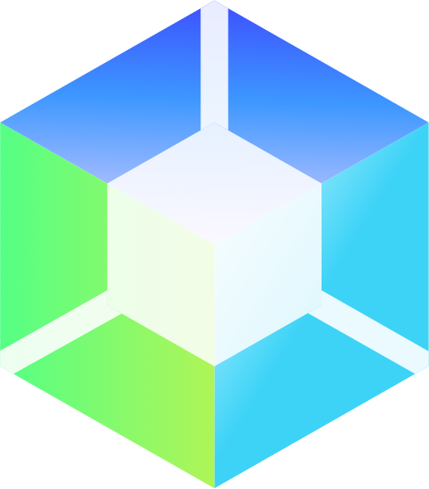

#  kcp

## Overview

kcp is a Kubernetes-like control plane focusing on:

- A **control plane** for many independent, **isolated** “clusters” known as **workspaces**
- Enabling API service providers to **offer APIs centrally** using **multi-tenant operators**
- Easy **API consumption** for users in their workspaces

kcp can be a building block for SaaS service providers who need a **massively multi-tenant platform** to offer services
to a large number of fully isolated tenants using Kubernetes-native APIs. The goal is to be useful to cloud
providers as well as enterprise IT departments offering APIs within their company.

**NB:** In May 2023, the kcp project was restructured and components related to workload scheduling (e.g. the syncer) and the transparent multi cluster (tmc) code were removed due to lack of interest/maintainers. Please refer to the [`main-pre-tmc-removal` branch](https://github.com/kcp-dev/kcp/tree/main-pre-tmc-removal) if you are interested in the related code.

## Documentation

Please visit [docs.kcp.io/kcp](https://docs.kcp.io/kcp) for our documentation.

## Contributing

We ❤️ our contributors! If you're interested in helping us out, please check out [contributing to kcp](https://docs.kcp.io/kcp/main/en/CONTRIBUTING).

## Getting in touch

There are several ways to communicate with us:

- The [`#kcp-dev` channel](https://app.slack.com/client/T09NY5SBT/C021U8WSAFK) in the [Kubernetes Slack workspace](https://slack.k8s.io)
- Our mailing lists:
    - [kcp-dev](https://groups.google.com/g/kcp-dev) for development discussions
    - [kcp-users](https://groups.google.com/g/kcp-users) for discussions among users and potential users
- See recordings of past community meetings on [YouTube](https://www.youtube.com/channel/UCfP_yS5uYix0ppSbm2ltS5Q)
- Check the [community meeting notes document](https://docs.google.com/document/d/1PrEhbmq1WfxFv1fTikDBZzXEIJkUWVHdqDFxaY1Ply4) for future and past meeting agendas.
- Browse the [shared Google Drive](https://drive.google.com/drive/folders/1FN7AZ_Q1CQor6eK0gpuKwdGFNwYI517M?usp=sharing) to share design docs, notes, etc.
    - Members of the kcp-dev mailing list can view this drive

## Additional references

- [KubeCon EU 2021: Kubernetes as the Hybrid Cloud Control Plane Keynote - Clayton Coleman (video)](https://www.youtube.com/watch?v=oaPBYUfdFE8)
- [OpenShift Commons: Kubernetes as the Control Plane for the Hybrid Cloud - Clayton Coleman (video)](https://www.youtube.com/watch?v=Y3Y11Aj_01I)
- [TGI Kubernetes 157: Exploring kcp: apiserver without Kubernetes](https://youtu.be/FD_kY3Ey2pI)
- [K8s SIG Architecture meeting discussing kcp - June 29, 2021](https://www.youtube.com/watch?v=YrdAYoo-UQQ)
- [Let's Learn kcp - A minimal Kubernetes API server with Saiyam Pathak - July 7, 2021](https://www.youtube.com/watch?v=M4mn_LlCyzk)
