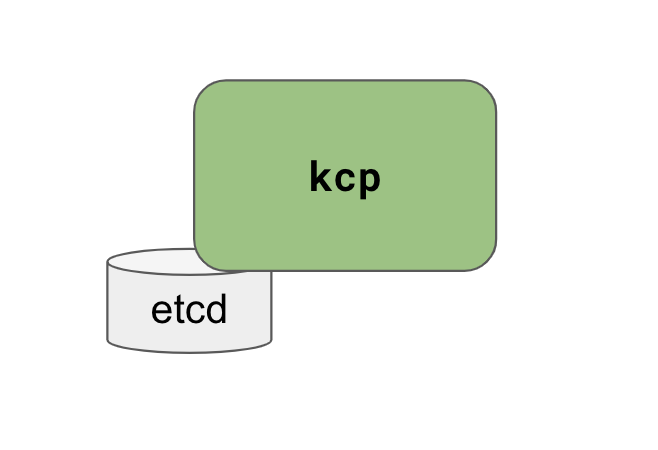
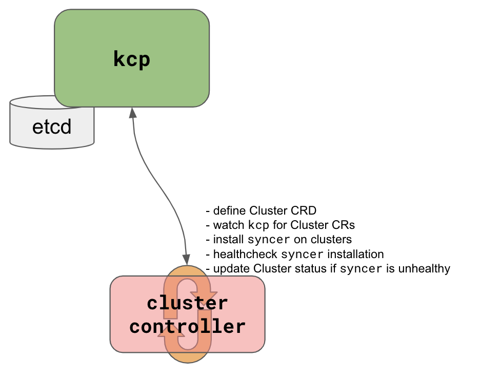
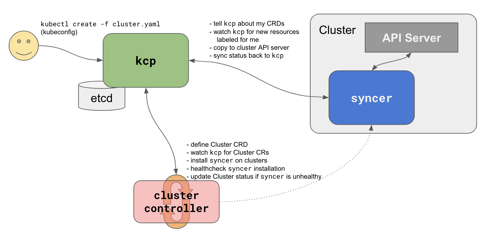
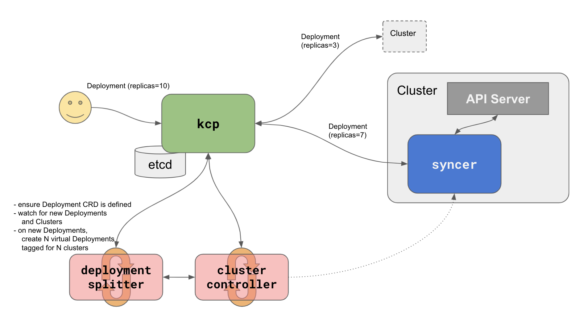

# `kcp` Multi-Cluster Architecture

This doc describes the basic architecture of `kcp` and other controllers in this repo that work with `kcp` to implement the [transparent multi-cluster](../investigations/transparent-multi-cluster.md) demo.

## `kcp`

`kcp` is a minimal Kubernetes API server, that only knows about basic types and `CustomResourceDefinition`s (CRDs).
Its code is found in `./cmd/kcp`.

It's responsible for storing data in a connected etcd cluster, and for enforcing RBAC on resources that it stores.
Its API allows clients to get, list, create, update, delete and watch resources.

</img>

`kcp` doesn't know about most of the core Kubernetes types (Pods, etc.), and expects users or controllers to define them as needed, and to run controllers to respond to those resources.

`kcp` doesn't support validating or mutating [admission controllers](https://kubernetes.io/docs/reference/access-authn-authz/admission-controllers/) at this time.

`kcp` is currently configured to create a new local etcd cluster at startup if one does not already exist.
In the future, flags will allow `kcp` to connect to an existing remote etcd cluster.

If all you want is a [minimal API server](../investigations/minimal-api-server.md), that talks a Kubernetes-style API and stores and serves data for you, you can stop now.
The rest of this doc describes additional components you can run with `kcp` to achieve transparent multi-cluster scheduling.

## Cluster CRD and Cluster Controller

The example [Cluster](../../config/workload.kcp.dev_clusters.yaml) CRD type holds information to reach and authenticate to another Kubernetes cluster's API server.
To do this, its `.spec.kubeconfig` field defines a YAML serialized [kubeconfig](https://kubernetes.io/docs/concepts/configuration/organize-cluster-access-kubeconfig/) file.

**NB:** A kubeconfig contains sensitive information to authenticate with a cluster's API server.
In the fullness of time we need a more secure mechanism for registering and authenticating to a cluster.

With the Cluster type defined, users can create Cluster resources to tell `kcp` about their clusters.

The Cluster Controller (`./cmd/cluster-controller`) connects to `kcp` and watches for new Cluster resources that get defined.
When a new resource is seen, the controller uses its `.spec.kubeconfig` to connect to the cluster and start a [Syncer](#syncer).

### CRD Puller

Before starting the Syncer, and continuously while it's connected to the cluster, the Cluster Controller watches the cluster's API resources to discover new types and updates to existing types.
The Cluster Controller uses this information to negotiate possible incompatible CRD type definitions, to determine whether an incoming resource can be sent to a cluster's Syncer.

</img>

**NB:** In these diagrams, controllers are depicted as separate, external boxes.
In reality, these control loops could be compiled in and embedded into the same binary as `kcp`, or run as remote external services.

## Syncer

The Syncer (`./cmd/syncer`) maintains a connection to the `kcp`, and to a Kubernetes cluster's API server.

After initial type negotiation, the Syncer watches for resources of all types that are scheduled to that cluster, using the `workloads.kcp.dev/cluster` label, and copies those resources to the Kubernetes cluster.

It also watches for updates to resources in its cluster, and mirrors any updates to `.status` to the `kcp`'s API.

</img>

**NB:** Syncer can run in one of three modes, determined by a flag given to the Cluster Controller that starts Syncers:

1. In `--pull` mode (pictured), the Syncer runs as a Pod inside the downstream cluster, communicating with the cluster's API server from inside the cluster.
1. In `--push` mode, Syncers run as goroutines in the Cluster Controller binary, communicating with the cluster's API server from outside the cluster.
1. In "none" mode, operators are expected to run the Syncer as a separate process. This is mainly to aid debugging.

There is ongoing discussion about where Syncers should run, and the answer might be "either inside or outside the cluster".
Its code should be structured to be agnostic to this distinction, since it only needs to be given two kubeconfigs, wherever it runs.

If the in-cluster Syncer ever becomes unreachable, or out-of-cluster Syncer fails to reach the downstream cluster, the Cluster's `.status.conditions` is update to indicate that the Cluster is not `Ready`.

## Deployment Splitter

The Deployment Splitter (`./cmd/deployment-splitter`) is an example of a very simple multi-cluster resource scheduler.
It watches for `Deployment` resources in the `kcp`, and determines how many of that Deployment's `replicas` should be scheduled to which of the available Cluster resources.

It currently does this very _very_ simply, by dividing the number of `replicas` evenly across available clusters.

When the Deployment Splitter splits a Deployment, it creates N new Deployment resources, each labeled for an available cluster (i.e., it labels each with `workloads.kcp.dev/cluster: my-cluster-name`).
This in turn instructs the [Syncer](#syncer) for that cluster to see the Deployment shard and sync it down to the cluster.

</img>

The Deployment Splitter is _very simple_, and would need lots of improvements to make it useable in a real production scenario:

- it should take into account whether the Cluster reports as `Ready`, in case the Syncer is having difficulty syncing to the cluster.
- it should take into account user provided scheduling hints such as affinity, anti-affinity, etc.
- it should take into account resources' dependencies and schedule dependent resources to the same cluster.
- it should continuously watch for new Cluster resources, to take advantage of those new resources and rebalance existing scheduling decisions.
- it should continuously watch for existing Cluster resources to report as not `Ready`, to unschedule resources from those clusters.
- it should become more generic, so that it can schedule resources of all types (e.g., `DaemonSet`s, `StatefulSet`s, `PersistentVolume`s, CRDs of all kinds).

-----

Taken together, these components are designed to work in concert to provide a robust system for scheduling generic resources across multiple clusters.
