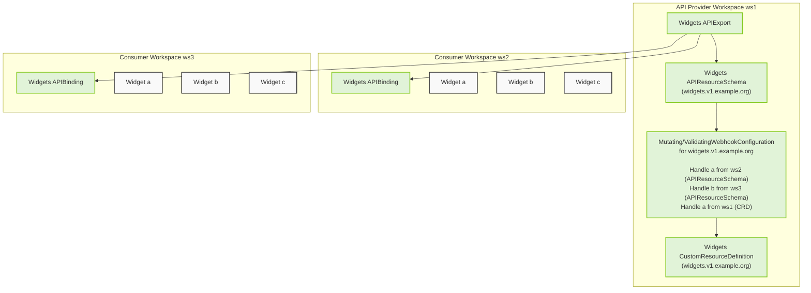

# Admission Webhooks

kcp extends the vanilla [admission plugins](https://kubernetes.io/docs/reference/access-authn-authz/admission-controllers/) for webhooks, and makes them cluster-aware.

When an object is to be mutated or validated, the webhook admission plugin ([`apis.kcp.io/MutatingWebhook`](https://github.com/kcp-dev/kcp/tree/main/pkg/admission/mutatingwebhook) and [`apis.kcp.io/ValidatingWebhook`](https://github.com/kcp-dev/kcp/tree/main/pkg/admission/validatingwebhook) respectively) looks for the owner of the resource schema. Once found, it then dispatches the handling for that object in the owner's workspace. There are two such cases in the diagram above:

* **Admitting bound resources.** During the request handling, Widget objects inside the consumer workspaces `ws2` and `ws3` are picked up by the respective webhook admission plugin. The plugin sees the resource's schema comes from an APIBinding, and so it sets up an instance of `{Mutating,Validating}Webhook` to be working with its APIExport's workspace, in `ws1`. Afterwards, normal webhook admission flow continues: the request is dispatched to all eligible webhook configurations inside `ws1` and the object in request is mutated or validated.
* **Admitting local resources.** The second case is when the webhook configuration exists in the same workspace as the object it's handling. The admission plugin sees the resource is not sourced via an APIBinding, and so it looks for eligible webhook configurations locally, and dispatches the request to the webhooks there. The same would of course be true if APIExport and its APIBinding lived in the same workspace: the APIExport would resolve to the same cluster.

Lastly, objects in admission review are annotated with the name of the workspace that owns that object. For example, when Widget `b` from `ws3` is being validated, its caught by `ValidatingWebhookConfiguration` in `ws1`, but the webhook will see `kcp.io/cluster: ws3` annotation on the reviewed object.
