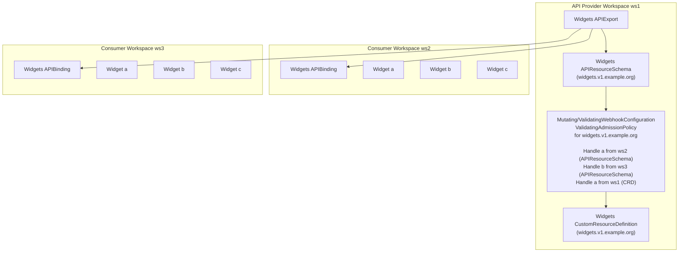

# Admission Webhooks

kcp extends the vanilla [admission plugins](https://kubernetes.io/docs/reference/access-authn-authz/admission-controllers/) for webhooks and validating admission policies, and makes them cluster-aware.



When an object is to be mutated or validated, the admission plugins ([`apis.kcp.io/MutatingWebhook`](https://github.com/kcp-dev/kcp/tree/main/pkg/admission/mutatingwebhook), [`apis.kcp.io/ValidatingWebhook`](https://github.com/kcp-dev/kcp/tree/main/pkg/admission/validatingwebhook), [`MutatingAdmissionPolicy`](https://github.com/kcp-dev/kcp/tree/main/pkg/admission/mutatingadmissionpolicy), and [`ValidatingAdmissionPolicy`](https://github.com/kcp-dev/kcp/tree/main/pkg/admission/validatingadmissionpolicy) respectively) look for the owner of the resource schema. Once found, they then dispatch the handling for that object in the owner's workspace. There are two such cases in the diagram above:

* **Admitting bound resources.** During the request handling, Widget objects inside the consumer workspaces `ws2` and `ws3` are picked up by the respective admission plugin. The plugin sees the resource's schema comes from an APIBinding, and so it sets up an instance of the admission plugin to be working with its APIExport's workspace, in `ws1`. Afterwards, normal admission flow continues: the request is dispatched to all eligible webhook configurations or admission policies inside `ws1` and the object in request is mutated or validated.
* **Admitting local resources.** The second case is when the webhook configuration or admission policy exists in the same workspace as the object it's handling. The admission plugin sees the resource is not sourced via an `APIBinding`, and so it looks for eligible webhook configurations or policies locally, and dispatches the request accordingly. The same would of course be true if `APIExport` and its `APIBinding` lived in the same workspace: the `APIExport` would resolve to the same cluster.

## ValidatingAdmissionPolicy Support

kcp supports cross-workspace `ValidatingAdmissionPolicy` and `ValidatingAdmissionPolicyBinding` resources, similar to how it supports cross-workspace webhooks. When a resource is created in a consumer workspace that is bound via an `APIBinding`, the `ValidatingAdmissionPolicy` plugin will:

1. Check the `APIBinding` to find the source workspace (`APIExport` workspace)
2. Look for `ValidatingAdmissionPolicy` and `ValidatingAdmissionPolicyBinding` resources in the source workspace
3. Apply those policies to validate the resource in the consumer workspace

This means that policies defined in an `APIExport` workspace will automatically apply to all resources created in consuming workspaces, providing a consistent validation experience across all consumers of an API.

### Example

Consider a scenario where:
- **Provider workspace** (`root:provider`) has:
  - An `APIExport` for `cowboys.wildwest.dev`
  - A `ValidatingAdmissionPolicy` that rejects cowboys with `intent: "bad"`
  - A `ValidatingAdmissionPolicyBinding` that binds the policy
  
- **Consumer workspace** (`root:consumer`) has:
  - An `APIBinding` that binds to the provider's `APIExport`
  - A user trying to create a cowboy with `intent: "bad"`

When the user creates the cowboy in the consumer workspace, the `ValidatingAdmissionPolicy` plugin will:
1. Detect that the cowboy resource comes from an `APIBinding`
2. Look up the source workspace (provider workspace)
3. Find and apply the policy from the provider workspace
4. Reject the cowboy creation because it violates the policy

This ensures that API providers can enforce consistent validation rules across all consumers of their APIs.

## MutatingAdmissionPolicy Support

kcp supports cross-workspace `MutatingAdmissionPolicy` and `MutatingAdmissionPolicyBinding` resources, similar to how it supports cross-workspace webhooks and ValidatingAdmissionPolicy. When a resource is created in a consumer workspace that is bound via an `APIBinding`, the `MutatingAdmissionPolicy` plugin will:

1. Check the `APIBinding` to find the source workspace (`APIExport` workspace)
2. Look for `MutatingAdmissionPolicy` and `MutatingAdmissionPolicyBinding` resources in the source workspace
3. Apply those policies to mutate the resource in the consumer workspace

This means that policies defined in an `APIExport` workspace will automatically apply to all resources created in consuming workspaces, providing a consistent mutation experience across all consumers of an API.

### How MutatingAdmissionPolicy Works

`MutatingAdmissionPolicy` uses [CEL (Common Expression Language)](https://kubernetes.io/docs/reference/using-api/cel/) to define mutations that are applied to resources during admission. Mutations can be specified using:

- **JSONPatch**: Patch operations (add, remove, replace, etc.) expressed as a CEL expression
- **ApplyConfiguration**: Server-side apply style patches

Mutations are applied after validation match conditions are evaluated, allowing you to conditionally mutate resources based on their current state.

### Enabling MutatingAdmissionPolicy

To use `MutatingAdmissionPolicy` in kcp, you need to:

1. **Enable the feature gate**: Start kcp with the `MutatingAdmissionPolicy` feature gate enabled:
   ```bash
   kcp start --feature-gates=MutatingAdmissionPolicy=true
   ```

2. **Verify the API is available**: Check that the API resources are listed:
   ```bash
   kubectl api-resources | grep mutatingadmissionpolicy
   ```

   You should see:
   ```
   mutatingadmissionpolicies        admissionregistration.k8s.io/v1beta1   false   MutatingAdmissionPolicy
   mutatingadmissionpolicybindings  admissionregistration.k8s.io/v1beta1   false   MutatingAdmissionPolicyBinding
   ```

### Example: Adding Labels to Resources

Consider a scenario where you want to automatically add a label to all `Cowboy` resources when they are created:

**Provider workspace** (`root:provider`) has:
- An `APIExport` for `cowboys.wildwest.dev`
- A `MutatingAdmissionPolicy` that adds a label `mutated-by: kcp-mutating-policy`
- A `MutatingAdmissionPolicyBinding` that binds the policy

```yaml
apiVersion: admissionregistration.k8s.io/v1beta1
kind: MutatingAdmissionPolicy
metadata:
  name: add-label-policy
spec:
  failurePolicy: Fail
  reinvocationPolicy: IfNeeded
  matchConstraints:
    resourceRules:
      - operations: ["CREATE"]
        apiGroups: ["wildwest.dev"]
        apiVersions: ["v1alpha1"]
        resources: ["cowboys"]
  mutations:
    - patchType: "JSONPatch"
      jsonPatch:
        expression: >
          [
            JSONPatch{
              op: 'add',
              path: '/metadata/labels/mutated-by',
              value: 'kcp-mutating-policy'
            }
          ]
---
apiVersion: admissionregistration.k8s.io/v1beta1
kind: MutatingAdmissionPolicyBinding
metadata:
  name: add-label-binding
spec:
  policyName: add-label-policy
```

**Consumer workspace** (`root:consumer`) has:
- An `APIBinding` that binds to the provider's `APIExport`
- A user creating a cowboy resource

When the user creates a cowboy in the consumer workspace:

```yaml
apiVersion: wildwest.dev/v1alpha1
kind: Cowboy
metadata:
  name: test-cowboy
  namespace: default
spec:
  intent: "test"
```

The `MutatingAdmissionPolicy` plugin will:
1. Detect that the cowboy resource comes from an `APIBinding`
2. Look up the source workspace (provider workspace)
3. Find and apply the policy from the provider workspace
4. Mutate the cowboy by adding the `mutated-by: kcp-mutating-policy` label

The resulting cowboy will have the label added:

```yaml
apiVersion: wildwest.dev/v1alpha1
kind: Cowboy
metadata:
  name: test-cowboy
  namespace: default
  labels:
    mutated-by: kcp-mutating-policy
spec:
  intent: "test"
```

Lastly, objects in admission review are annotated with the name of the workspace that owns that object. For example, when Widget `b` from `ws3` is being validated or mutated, it's caught by `MutatingWebhookConfiguration`, `ValidatingWebhookConfiguration`, `MutatingAdmissionPolicy`, or `ValidatingAdmissionPolicy` in `ws1`, but the webhook or policy evaluator will see `kcp.io/cluster: ws3` annotation on the reviewed object.
