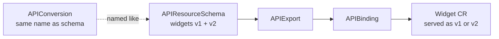

# APIConversion

!!! warning
    As of this release, `APIConversion` is alpha-quality. Enable it with the
    `APIConversion` feature gate on each shard (and the cache server, if used):

    ```bash
    kcp start --feature-gates=APIConversion=true
    ```

In upstream Kubernetes, multi-version CustomResourceDefinitions typically rely on a
[conversion webhook](https://kubernetes.io/docs/tasks/extend-kubernetes/custom-resources/custom-resource-definition-versioning/#webhook-conversion)
to translate objects between API versions. kcp does **not** support CRD conversion
webhooks.

For APIs published through an [`APIResourceSchema`](./exporting-apis.md#define-apiresourceschemas),
kcp provides `APIConversion`: in-cluster conversion rules expressed as field mappings
and optional [CEL](https://github.com/google/cel-spec) transformations. Rules are
evaluated by the apiserver when an object is read or written at a non-storage version.

## How it fits together

1. Define a multi-version `APIResourceSchema` (one storage version, one or more served versions).
2. Create an `APIConversion` **with the same name** as that schema.
3. Export and bind the schema as usual via `APIExport` / `APIBinding`.

When consumers (or the provider workspace itself) create or get resources at a served
version that is not the storage version, kcp applies the matching conversion rules.



## Naming

The `APIConversion` object **must** have the same `metadata.name` as the
`APIResourceSchema` it converts. For bound CRDs, kcp looks up the conversion in the
schema's owning workspace using the schema name annotations on the bound CRD.

## Conversion rules

Each entry under `spec.conversions` describes how to convert **from** one version
**to** another:

| Field | Meaning |
| --- | --- |
| `from` / `to` | Source and target API versions (for example `v1` → `v2`) |
| `rules[].field` | JSONPath of the source field (relative to the object root), e.g. `.spec.firstName` |
| `rules[].destination` | JSONPath of the target field, e.g. `.spec.name.first` |
| `rules[].transformation` | Optional CEL expression; the source value is available as `self` |
| `preserve` | Optional list of fields to keep across round-trips when the destination version lacks them |

If `transformation` is omitted, the source value is copied as-is.

You normally need rules in **both directions** (for example `v1→v2` and `v2→v1`) so
clients can use either served version.

### Preserve (avoid data loss)

When converting to an older version that does not have a newer field, values would
otherwise be dropped. List those paths under `preserve`. kcp stores them in an
annotation prefixed with `preserve.conversion.apis.kcp.io/` and restores them when
converting back.

## Example

A `widgets` schema with storage version `v1` and served version `v2`, plus matching
conversion rules (including a CEL `upperAscii()` transform and a preserved field):

```yaml
apiVersion: apis.kcp.io/v1alpha1
kind: APIResourceSchema
metadata:
  name: rev0002.widgets.example.io
spec:
  group: example.io
  names:
    kind: Widget
    listKind: WidgetList
    plural: widgets
    singular: widget
  scope: Cluster
  conversion:
    strategy: None
  versions:
  - name: v1
    served: true
    storage: true
    schema:
      type: object
      properties:
        apiVersion:
          type: string
        kind:
          type: string
        metadata:
          type: object
        spec:
          type: object
          properties:
            firstName:
              type: string
            lastName:
              type: string
  - name: v2
    served: true
    storage: false
    schema:
      type: object
      properties:
        apiVersion:
          type: string
        kind:
          type: string
        metadata:
          type: object
        spec:
          type: object
          properties:
            name:
              type: object
              properties:
                first:
                  type: string
                last:
                  type: string
                lastUpper:
                  type: string
            someNewField:
              type: object
              properties:
                hello:
                  type: string
---
apiVersion: apis.kcp.io/v1alpha1
kind: APIConversion
metadata:
  name: rev0002.widgets.example.io # must match the APIResourceSchema name
spec:
  conversions:
  - from: v1
    to: v2
    rules:
    - field: .spec.firstName
      destination: .spec.name.first
    - field: .spec.lastName
      destination: .spec.name.last
    - field: .spec.lastName
      destination: .spec.name.lastUpper
      transformation: self.upperAscii()
  - from: v2
    to: v1
    rules:
    - field: .spec.name.first
      destination: .spec.firstName
    - field: .spec.name.last
      destination: .spec.lastName
    preserve:
    - .spec.someNewField
```

After exporting and binding this schema, creating a Widget as `example.io/v1` and
getting it as `example.io/v2` applies the `v1→v2` rules (and the reverse on write-back).

## Validation

When the feature gate is enabled, an admission plugin validates `APIConversion`
objects on create/update by compiling the CEL rules against the referenced
`APIResourceSchema` (or a same-named local CRD). Invalid paths or CEL expressions
are rejected before the object is persisted.

## Server flags

| Flag | Default | Purpose |
| --- | --- | --- |
| `--feature-gates=APIConversion=true` | off | Enable native API conversion |
| `--conversion-cel-transformation-timeout` | `1s` | Per-object timeout for CEL transformations during conversion |

## Limitations

- Conversion **webhooks** on CRDs remain unsupported; use `APIConversion` for exported multi-version schemas instead.
- Rules are field-oriented. Transforming **list items** (or other nested collection shapes) is limited compared to a full webhook converter—prefer flat or object field mappings where possible.
- `APIConversion` applies to schemas served through kcp's conversion factory (bound/`APIResourceSchema` APIs). Plan for bidirectional rules and `preserve` when evolving fields.

## See also

- [Exporting and Binding APIs](./exporting-apis.md) — defining schemas, exports, and bindings
- [APIConversion API reference](../../reference/crd/apis.kcp.io/apiconversions/) — generated CRD docs
