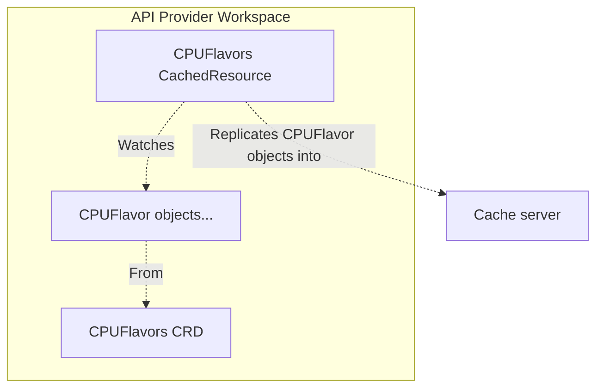
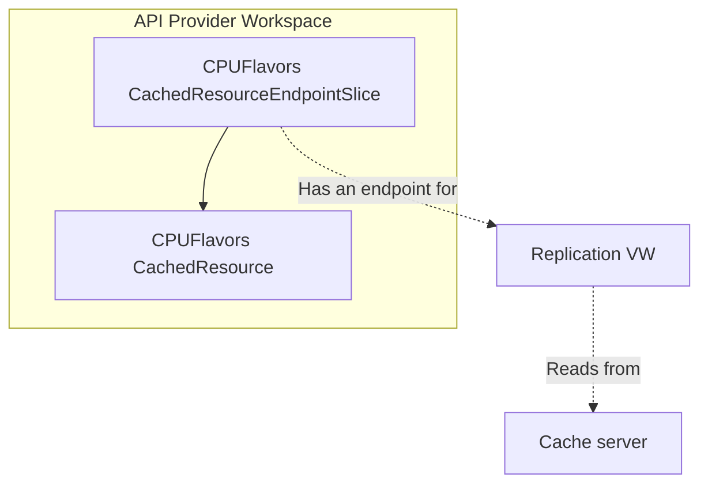
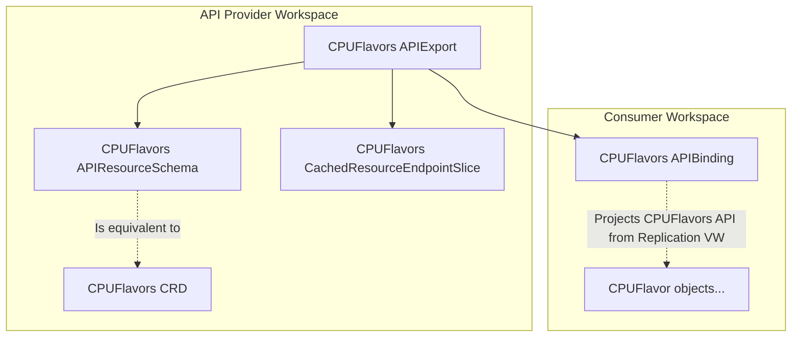

# CachedResource API

!!! warning
    As of 0.29, this feature is of alpha-version quality. To use it, enable the `CachedAPIs` feature gate.

A CachedResource object replicates a user-defined resource from its workspace into kcp's [cache server](../sharding/cache-server.md). It may be used as an [APIExport virtual resource](./exporting-apis.md#virtual-resources) with the goal of distributing static, read-only resources to multiple clusters, in a scalable way.

**Example user story:**

- You, the **service provider**, run a cloud _Cloud Co._, including a compute service.
- You offer a service of provisioning and running VM instances: users create an `Instance` object and voilà, they have a running VM!
    - But how do you design the API for configuring such a resource? How do you make your consumers know what configuration options are available, given the limited resources available in the cloud?
    - You've decided to offer different packages for CPUs, memory, storage, GPUs; these are represented as CRDs, e.g. `cpuflavors.cloud.example.com`, `memflavors.cloud.example.com`, with `cpu-small`, `cpu-medium`, `cpu-large`, `mem-medium`, `mem-large`, `mem-xlarge` respectively.
    - You've created a CachedResource for each flavor type.
    - You offer the service through an APIExport containing the main `instances.cloud.example.com` resource, as well as all flavors. These are exported as [virtual resources](./exporting-apis.md#virtual-resources).
- **Consumers** binding to your APIExport can list and get the available flavors from within their workspace (e.g. with `kubectl get cpuflavors`), and refer to them in their `Instance` spec. They cannot create, delete or otherwise modify the flavor objects in any way.

See an example usage at [github.com/kcp-dev/kcp/tree/main/config/examples/virtualresources](https://github.com/kcp-dev/kcp/tree/main/config/examples/virtualresources).

## Resource replication

```yaml
apiVersion: cache.kcp.io/v1alpha1
kind: CachedResource
metadata:
  name: cpuflavors-v1
spec:
  group: cloud.example.com
  version: v1
  resource: cpuflavors
```

The snippet above shows an example where all `cpuflavors.v1.cloud.example.com` objects in the workspace are replicated to the cache. There are some constraints on what resources may be replicated:

- There may be only one CachedResource for a particular group-version-resource triplet in the workspace.
- The resource must be cluster scoped.
- The resource must not be a [built-in API](./built-in.md) or kcp system API belonging to `apis.kcp.io` group.
- The resource may be originating from a CRD or an APIBinding.

Once created, resource replication progress may be checked in CachedResource's status:

```yaml
apiVersion: cache.kcp.io/v1alpha1
kind: CachedResource
metadata:
  name: cpuflavors-v1
status:
  conditions:
  - lastTransitionTime: "2025-10-21T14:03:41Z"
    status: "True"
    type: IdentityValid
  - lastTransitionTime: "2025-10-21T14:03:42Z"
    status: "True"
    type: ReplicationStarted
  - lastTransitionTime: "2025-10-21T14:03:41Z"
    status: "True"
    type: ResourceValid
  identityHash: cd2eb0837...
  phase: Ready
  resourceCounts:
    cache: 8 # (1)
    local: 8 # (2)
```

1. `cache` resource count refers to the count of objects currently in cache for this CachedResource.
2. `local` resource count refers to the count of objects the CachedResource currently sees in its workspace.

The objects a CachedResource is watching are always replicated in the direction **from** CachedResource's workspace **into** cache. Note that this means the only way to modify the in-cache copies is to modify the original objects. In-cache objects can be then projected into a workspace as a read-only API. This is done by creating a respective APIExport with [CachedResource virtual resource](#exporting-cachedresources), and binding to it.



You can optionally configure the following additional aspects of a CachedResource:

- its identity
- its endpoint slice
- resource selector

We'll talk about each of these next.

### CachedResource identity

Similar to the [APIExport identity](./exporting-apis.md#apiexport-identity) concept, there may be many CachedResources with the same group-version-resource triplet across kcp instances. To differentiate between them and identify owners, a CachedResource object uses a unique identity key stored in a secret.

The identity **key** is considered a private key and should not be shared.

**Hash** calculated from that key, found at `.status.identityHash`, is considered a public key. APIExport's virtual resource definition expects this identity hash to be supplied when exporting a CachedResource.

By default, creating a CachedResource object triggers creation of an identity secret with a randomly generated key in its `key` data item. You can provide your own key by referencing your secret in the object's spec:

```yaml
apiVersion: v1
kind: Secret
metadata:
  name: my-cached-cpuflavors-identity
  namespace: default
stringData:
  key: "<Your identity key>"
---
apiVersion: cache.kcp.io/v1alpha1
kind: CachedResource
metadata:
  name: cpuflavors-v1
spec:
  identity:
    secretRef:
      name: my-cached-cpuflavors-identity
      namespace: default
  ...
```

### CachedResourceEndpointSlice

While CachedResources replicates their associated resources to the cache server, retrieval of these in-cache resources is done through the Replication [virtual workspace](../workspaces/virtual-workspaces.md). The Replication VW is an API server dedicated to CachedResources, and is able to access the resource's objects with read-only verbs get, list and watch.

The Replication VW endpoints are listed in CachedResourceEndpointSlice. This endpoint slice is compatible with APIExport's [virtual resources](./exporting-apis.md#virtual-resources) and can be used as storage source.

With that said, the Replication VW is consumer-aware, and needs a valid APIExport and APIBinding(s) to operate. Therefore it is much more convenient to access the in-cache resources through regular APIBindings in a workspace and/or the APIExport VW rather than accessing them through the Replication VW. Consider the Replication VW just as an implementation detail of the CachedResource API, and when consuming it, use APIExports.



For convenience, creating a CachedResource triggers creation of a CachedResourceEndpointSlice object under the same name. This behaviour can be disabled by adding `cachedresources.cache.kcp.io/skip-endpointslice` annotation to the CachedResource object. You can create your own like so:

```yaml
apiVersion: cache.kcp.io/v1alpha1
kind: CachedResourceEndpointSlice
metadata:
  name: cpuflavors-v1
spec:
  cachedResource:
    name: cpuflavors-v1 # (1)
```

1. Name of the CachedResource this endpoint slice is referencing. Currently, both CachedResource and CachedResourceEndpointSlice must be co-located in the same workspace. See <https://github.com/kcp-dev/kcp/issues/3658>

### Selectors

CachedResource spec has an optional [`labelSelector`](https://kubernetes.io/docs/concepts/overview/working-with-objects/labels/#label-selectors) field which can be used to shape the set of objects it picks up.

```yaml
apiVersion: cache.kcp.io/v1alpha1
kind: CachedResource
metadata:
  name: cpuflavors-v1
spec:
  group: cloud.example.com
  version: v1
  resource: cpuflavors
  labelSelector:
    cloud.example.com/visibility: Public
```

## Exporting CachedResources

You can project the replicated read-only objects of a CachedResource into a workspace using the standard APIExport-APIBinding relationship. Create an APIExport and define [virtual resource](./exporting-apis.md#virtual-resources) for the associated [CachedResourceEndpointSlice](#cachedresourceendpointslice). Consumers can then bind to it.

```yaml
apiVersion: apis.kcp.io/v1alpha2
kind: APIExport
metadata:
  name: compute.cloud.example.com
spec:
  resources:
  - group: cloud.example.com
    name: cpuflavors
    schema: v250801.cpuflavors.cloud.example.com # (1)
    storage:
      virtual:
        reference: # (2)
          apiGroup: cache.kcp.io
          kind: CachedResourceEndpointSlice
          name: cpuflavors-v1
        identityHash: cd2eb0837... # (3)
```

1. Resource schema must match the schema used by the resource in the associated CachedResource.
2. Reference to the CachedResourceEndpointSlice endpoint slice `cpuflavors-v1`.
3. Identity hash of the `cpuflavors-v1` CachedResource object.

A `virtual` storage definition needs (1) a reference to an [endpoint slice](./exporting-apis.md#endpoint-slices) object, and (2) a virtual resource identity. In the case of CachedResources, the endpoint slice is provided by CachedResourceEndpointSlice. For convenience, a matching CachedResourceEndpointSlice object is automatically created when creating a CachedResource. The identity hash must match the one set in CachedResource's `.status.identityHash`.



Note the APIResourceSchema referenced by the APIExport example above: the Replication VW follows that reference, and that schema is then used to serve the resource in consumers' workspaces. The provider must therefore ensure that it is kept in-sync with the schema of the original resource.
