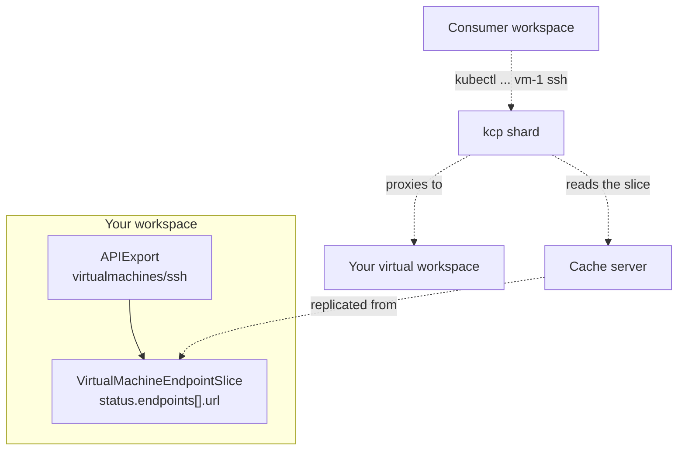

# Custom subresources

!!! warning
    This feature is of alpha-version quality. To use it, enable the `CacheAPIs` feature gate.
    With the gate off, an APIExport that declares a custom subresource still applies, but the
    subresource is never served: requests for it fall through to CRD storage and return 404.

A custom subresource is a named action hanging off an exported resource, served by a virtual
workspace rather than stored in etcd. It is the shape `pods/exec` and `serviceaccounts/token`
already have in Kubernetes, made available to anyone exporting an API through kcp.

A `VirtualMachine` keeps its `spec` and `status` in etcd as usual, and gains
`virtualmachines/ssh` that opens a stream to the running guest. A `Database` gains
`databases/backup` that kicks off a job. A `Cluster` gains `clusters/kubeconfig` that mints
short-lived credentials.

Subresources are worth reaching for because of what they inherit. They take the parent's name,
so a request names one object rather than carrying an identifier in a body. They take the
parent's RBAC noun, so `virtualmachines/ssh` is grantable on its own. And they appear in
discovery, so `kubectl` and generated clients find them.

This is independent of how the parent is stored. Declaring `/ssh` does not move a
`VirtualMachine` out of etcd.

## Declaring one

A custom subresource is an entry in `spec.resources[]` in its own right, named
`<resource>/<subresource>` in the style of an RBAC rule. It sits next to the resource it
belongs to:

```yaml
apiVersion: apis.kcp.io/v1alpha2
kind: APIExport
metadata:
  name: compute
spec:
  resources:
  - name: virtualmachines
    group: compute.example.com
    schema: v1alpha1.virtualmachines.compute.example.com
    storage:
      crd: {}                       # the object itself stays in etcd

  - name: virtualmachines/ssh       # the subresource, its own entry
    group: compute.example.com
    schema: v1alpha1.ssh.compute.example.com
    storage:
      virtual:
        reference:
          apiGroup: compute.example.com
          kind: VirtualMachineEndpointSlice
          name: compute
```

Four rules apply, and an APIExport that breaks any of them is rejected:

- **The subresource may not be `status` or `scale`.** Those belong to the object's shape, are
  declared on the [APIResourceSchema](./exporting-apis.md#define-apiresourceschemas), and are
  served wherever the resource itself is served.
- **The entry must use [virtual storage](./exporting-apis.md#virtual-resources).** There is no
  CustomResourceDefinition for a subresource to live in.
- **The resource it names must be exported by the same APIExport.** Otherwise the entry
  describes a subresource of nothing.
- **The schema is named after the subresource.** `virtualmachines/ssh` takes an
  APIResourceSchema whose name ends in `.ssh.compute.example.com`, describing the
  subresource's own kind rather than its parent's.

Note that you declare no verbs and no subresource "type". The verbs consumers see are the ones
your virtual workspace advertises in its own discovery, so the two cannot disagree. Whether a
subresource streams is decided per request, from whether the client asked to upgrade the
connection.

## Publishing the backend

The `reference` names an object whose status carries the URL of the virtual workspace serving
the subresource. kcp reads that object unstructured, so it may be of any kind. What it needs is
this shape:

```yaml
apiVersion: compute.example.com/v1alpha1
kind: VirtualMachineEndpointSlice
metadata:
  name: compute
status:
  endpoints:
  - url: https://vm-service.example.com:8443/services/vm/<provider cluster>/compute
    shards:
      matchAll: true
```

Set `shards.matchAll: true` unless you run one virtual workspace per shard and select them with
labels. An endpoint that says neither is only adopted when its URL already carries the serving
shard's own prefix, because a lone unqualified URL reads the same whether it is one workspace
for the whole installation, another shard's, or a stale one.

The object lives in your own workspace, and kcp arranges for it to reach the shards: an
APIExport that references an object gets a
[ClusterCachedResource](./cached-resources.md) for it automatically. One ordering constraint
follows from that. The referenced kind must be established before the APIExport points at it,
or nothing is ever replicated.

Nothing in kcp writes that status for you. You define the kind and run something that fills in
the URL, the same way the endpoint slice controller in the
[ephemeral resources proof of concept](https://github.com/kcp-dev/contrib-virtual-workspaces)
does.



## What your server receives

The shard reverse-proxies the request with its path intact, under the URL you published:

```
<your published url>/clusters/<consumer cluster>/apis/compute.example.com/v1alpha1/virtualmachines/vm-1/ssh
```

Your root path resolver strips everything through `/clusters/<consumer cluster>` and hands the
rest to the dynamic apiserver, which sees an ordinary `/apis/...` request.

Three things about that connection matter.

**The caller arrives in headers, not a token.** The connection authenticates as the shard, so
the caller's identity travels in `X-Remote-User`, `X-Remote-Group` and `X-Remote-Extra-*`.
Believe those headers only over a connection whose client certificate your
`--requestheader-client-ca-file` accepts. This is the same arrangement the front proxy already
uses to reach shards. Inbound copies are stripped before the shard stamps its own, so a client
cannot assert an identity by setting the headers itself.

**Be reached from the shard, not through the front proxy.** The front proxy restamps those
headers from its own authentication, so a virtual workspace behind it sees the proxy's
assessment of the caller rather than the shard's.

**Never delegate the request back to the shard.** A hop counter catches the cycle and fails the
request with an explanation, but the configuration is the thing to fix: the endpoint you
published must point at a workspace that actually serves the subresource.

## Building the virtual workspace

Build on the virtual workspace framework, as the in-tree workspaces do. Your
`RestProviderFunc` returns the subresource storages alongside the main one, keyed by bare
subresource name:

```go
func provideRestStorage(...) apiserver.RestProviderFunc {
	return func(resource schema.GroupVersionResource, kind, listKind schema.GroupVersionKind, ...) (rest.Storage, map[string]rest.Storage) {
		return mainStorage, map[string]rest.Storage{
			"ssh": &sshStorage{},
		}
	}
}
```

What your storage implements decides what consumers can do with it, because discovery derives
the advertised verbs by type-asserting it.

- For a **request/response** subresource, in the style of `serviceaccounts/token`, implement
  `rest.NamedCreater`, `rest.Getter`, `rest.Updater` or `rest.Patcher`. A subresource is
  created against a named parent, so create goes through `NamedCreater`.
- For a **streaming** subresource, in the style of `pods/exec`, implement `rest.Connecter`. The
  methods you return from `ConnectMethods` are what the handler accepts and what discovery
  advertises, mapped to the usual verbs: a POST is authorized as `create`, a GET as `get`.

A subresource may produce a different kind from its parent, and the framework handles that: the
kind is taken from the object your storage's `New` returns.

Two things to enforce yourself. Check that the parent object exists and that the caller may see
it, by reading it back before acting, which is what `serviceaccounts/token` does. And check that
the consumer cluster named in the URL actually has an APIBinding to your APIExport listing that
resource, because without it anyone who can reach your endpoint can name any workspace.

## Using it as a consumer

Nothing special. Bind the APIExport as usual, and the subresource appears in discovery:

```console
$ kubectl api-resources --api-group=compute.example.com
NAME                    SHORTNAMES   APIVERSION                       NAMESPACED   KIND
virtualmachines                      compute.example.com/v1alpha1     false        VirtualMachine
virtualmachines/ssh                  compute.example.com/v1alpha1     false        VirtualMachine
```

Access is ordinary RBAC on the subresource noun. Note the verb is the one derived from the HTTP
method, not a literal `connect`, matching `pods/exec`:

```yaml
apiVersion: rbac.authorization.k8s.io/v1
kind: ClusterRole
metadata:
  name: vm-operator
rules:
- apiGroups: ["compute.example.com"]
  resources: ["virtualmachines/ssh"]
  verbs: ["create"]
```

A service provider reaching a consumer's objects through its own virtual workspace claims a
subresource the same way, in the
[permission claim](./exporting-apis.md#permission-claims) spelling that already exists:

```yaml
permissionClaims:
- group: compute.example.com
  resource: virtualmachines/ssh
  verbs: ["create"]
```

## Limitations

- The feature is behind the alpha `CacheAPIs` gate, and with the gate off a declared
  subresource is silently not served rather than rejected.
- kcp ships no endpoint-slice kind for this. You define the kind and publish the URL yourself.
- Streaming through two reverse proxies works over HTTP/1.1 upgrades. Prefer websockets over
  SPDY for new APIs.
- Consumer discovery depends on your virtual workspace answering a discovery request. A
  workspace that is down costs its own subresources their entry in the discovery document.
- The shard proxies the request without decoding it, so no admission plugin on the shard sees a
  subresource body or stream. Enforce policy in your own virtual workspace.
