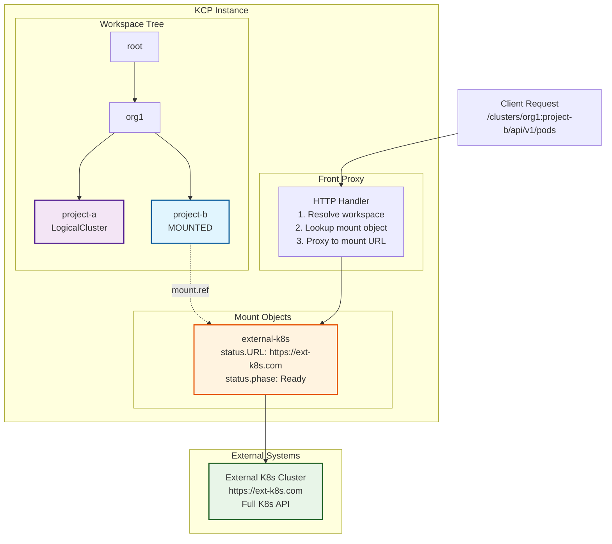

# Workspace Mounts

Workspace mounts allow you to mount external Kubernetes-like API endpoints onto a workspace. When a workspace uses a mount, it does not have a LogicalCluster backing it. Instead, requests to the workspace are proxied to the external API endpoint specified by the mount object. 

In a way it allows to have unified view of multiple clusters and workspaces under same workspace tree/hierarchy.

## Architecture Overview


```mermaid
graph TB
    subgraph "KCP Instance"
        subgraph "Workspace Tree"
            root[root]
            org1[org1]
            projectA[project-a<br/>LogicalCluster]
            projectB[project-b<br/>MOUNTED]
            
            root --> org1
            org1 --> projectA
            org1 --> projectB
        end
        
        subgraph "Mount Objects"
            extK8s[external-k8s<br/>status.URL: https://ext-k8s.com<br/>status.phase: Ready]
        end
        
        subgraph "Front Proxy"
            proxy[HTTP Handler<br/>1. Resolve workspace<br/>2. Lookup mount object<br/>3. Proxy to mount URL]
        end
        
        projectB -.->|mount.ref| extK8s
    end
    
    subgraph "External Systems"
        realK8s[External K8s Cluster<br/>https://ext-k8s.com<br/>Full K8s API]
    end
    
    client[Client Request<br/>/clusters/org1:project-b/api/v1/pods]
    
    client --> proxy
    proxy --> extK8s
    extK8s --> realK8s
    
    classDef mounted fill:#e1f5fe,stroke:#01579b,stroke-width:2px
    classDef regular fill:#f3e5f5,stroke:#4a148c,stroke-width:2px
    classDef mount fill:#fff3e0,stroke:#e65100,stroke-width:2px
    classDef external fill:#e8f5e8,stroke:#1b5e20,stroke-width:2px
    
    class projectB mounted
    class projectA regular
    class extK8s mount
    class realK8s external
```

### Workspace Tree Structure

```
root/
└── org1/
    ├── project-a/                    # Traditional LogicalCluster workspace
    │   ├── LogicalCluster object     # ✓ Has backing logical cluster
    │   ├── /api/v1/configmaps       # ✓ Served by kcp directly  
    │   └── /api/v1/secrets          # ✓ Standard Kubernetes APIs
    │
    └── project-b/                    # Mounted workspace
        ├── spec.mount.ref            # ✗ No LogicalCluster object
        │   └── "external-k8s"        # → References mount object
        ├── /api/v1/pods             # → Proxied to https://ext-k8s.com/api/v1/pods . kcp does not have pods, but this is a mount.
        └── /apis/apps/v1/deployments # → Proxied to https://ext-k8s.com/api/v1/deployments
```

## How it works

### Prerequisites

1. **Feature Gate**: The `WorkspaceMounts=true` feature gate must be enabled on the kcp instance.
2. **External Proxy**: An external proxy must be present to serve workspace requests and forward them to the target cluster. This can be any custom proxy, but typically follows the `virtual-workspace` pattern. See example [here](https://github.com/kcp-dev/contrib/tree/main/20241013-kubecon-saltlakecity/mounts-vw).

### Mount Objects
Workspace mounts can be represented by any arbitrary Kubernetes object. The object must meet specific requirements to function as a mount.

**Example mount object:**
```yaml
apiVersion: mounts.contrib.kcp.io/v1alpha1
kind: KubeCluster
metadata:
  name: proxy-cluster
  annotations:
    experimental.tenancy.kcp.io/is-mount: "true"
spec:
  mode: Delegated
  secretString: kTPlAYLMjKJDRly5
status:
  URL: https://proxy-cluster.proxy-cluster.svc.cluster.local
  phase: Ready
```

**Requirements for mount objects:**

1. **Annotation**: Must have the `experimental.tenancy.kcp.io/is-mount: "true"` annotation
2. **Status URL**: Must have a `status.URL` field containing the target endpoint URL
3. **Status Phase**: Must have a `status.phase` field with one of the following values:
   - `Initializing`: The mount proxy is being initialized
   - `Connecting`: The mount proxy is waiting for connection
   - `Ready`: The mount proxy is ready and connected
   - `Unknown`: The mount proxy status is unknown

**Note**: Mount objects can be created and managed by users or by the system. For example, if a user has credentials for a delegated cluster, they can create a mount object and reference it in their workspace. 


### Creating a Mounted Workspace

To create a workspace that uses a mount, specify the mount reference in the workspace spec:

```yaml
apiVersion: tenancy.kcp.io/v1alpha1
kind: Workspace
metadata:
  name: mounted-workspace
spec:
  mount:
    ref:
      apiVersion: mounts.contrib.kcp.io/v1alpha1
      kind: KubeCluster
      name: proxy-cluster
```

**Mount field requirements:**
- `ref.apiVersion`: The API version of the mount object
- `ref.kind`: The kind of the mount object  
- `ref.name`: The name of the mount object
- `ref.namespace`: (Optional) The namespace of the mount object if it's namespaced

**Important**: The mount reference is immutable after workspace creation.

### How Mounted Workspaces Work

Once a workspace with a mount is created, the following process occurs:

1. **No LogicalCluster Creation**: The workspace will not have a LogicalCluster backing it. Instead, it relies entirely on the external proxy.

2. **Mount Resolution**: The kcp front proxy resolves the mount object referenced in the workspace spec.

3. **URL Resolution**: When requests are made to the workspace, the proxy:
   - Looks up the mount object
   - Extracts the `status.URL` from the mount object
   - Forwards requests only if the mount object is in `Ready` phase
   - Returns an error if the mount object is not found or not ready

4. **Request Routing**: The proxy rewrites the incoming request URL to target the mount's URL while preserving the Kubernetes API context (e.g., `/api/v1/pods` becomes `{mount.status.URL}/api/v1/pods`).

### Controllers and Management

The workspace mounts controller (`kcp-workspace-mounts`) manages the integration between workspaces and their mount objects:

- **Watches**: Both workspace objects and dynamically discovered mount resources
- **Reconciliation**: Updates workspace annotations and status based on mount object state
- **Indexing**: Maintains indexes to efficiently find workspaces that reference specific mount objects
- **Status Updates**: Updates workspace conditions based on mount availability and readiness

### Limitations and Considerations

- Mount references are immutable after workspace creation
- Only mount objects in `Ready` phase will serve traffic
- The external proxy must be properly configured and accessible
- Authentication and authorization are handled by the external proxy, not by kcp
- Workspace mounts do not filter kubernetes view. If filtering is required, it must be implemented in the external proxy.