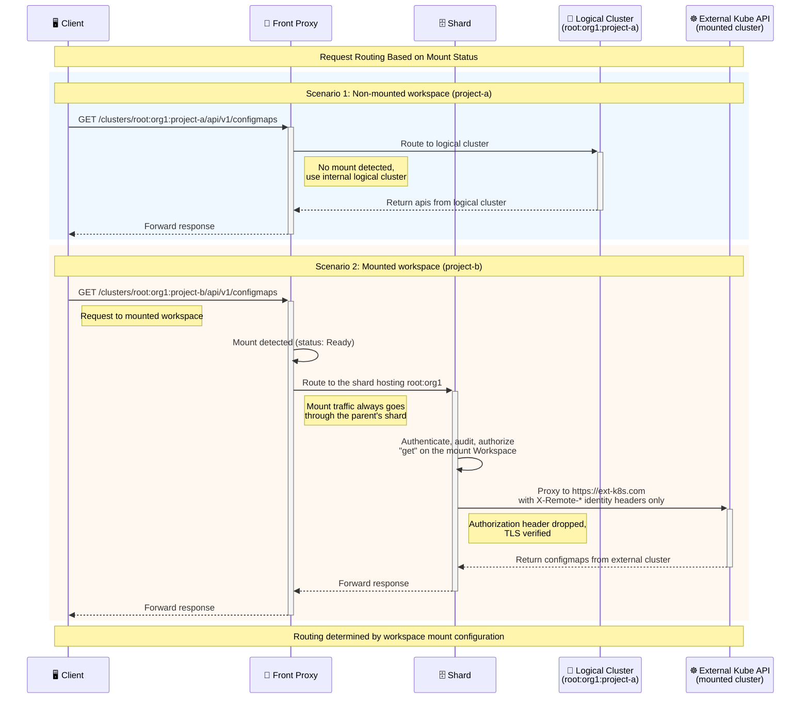

# Workspace Mounts

Workspace mounts allow you to mount external Kubernetes-like API endpoints onto a workspace, similar to how you mount remote filesystems in Linux using NFS. Just like a Linux directory can be a local folder or a mounted remote filesystem, a workspace can be either a local LogicalCluster or a mounted external endpoint.

When a workspace uses a mount, it does not have a LogicalCluster backing it. Instead, requests to the workspace are proxied to the external API endpoint specified by the mount object. This allows you to have a unified view of multiple clusters and workspaces under the same workspace tree/hierarchy.

**Analogy**: Think of workspaces as directories in a Linux filesystem:
- **Regular workspace** = Local directory with files stored on the local filesystem
- **Mounted workspace** = Directory that's an NFS mount pointing to a remote filesystem
- **kcp** = The filesystem manager that routes requests to the right location

## Architecture Overview


```mermaid
sequenceDiagram
      participant C as 🖥️ Client
      participant P as 🔄 Front Proxy
      participant S as 🗄️ Shard
      participant LC as 🧠 Logical Cluster<br/>(root:org1:project-a)
      participant EK as ☸️ External Kube API<br/>(mounted cluster)

      Note over C,EK: Request Routing Based on Mount Status

      rect rgb(240, 248, 255)
          Note over C,EK: Scenario 1: Non-mounted workspace (project-a)
          C->>+P: GET /clusters/root:org1:project-a/api/v1/configmaps
          P->>+LC: Route to logical cluster
          Note right of P: No mount detected,<br/>use internal logical cluster
          LC-->>-P: Return apis from logical cluster
          P-->>-C: Forward response
      end

      rect rgb(255, 248, 240)
          Note over C,EK: Scenario 2: Mounted workspace (project-b)
          C->>+P: GET /clusters/root:org1:project-b/api/v1/configmaps
          Note right of C: Request to mounted workspace
          P->>P: Mount detected (status: Ready)
          P->>+S: Route to the shard hosting root:org1
          Note right of P: Mount traffic always goes<br/>through the parent's shard
          S->>S: Authenticate, audit, authorize<br/>"get" on the mount Workspace
          S->>+EK: Proxy to https://ext-k8s.com<br/>with X-Remote-* identity headers only
          Note right of S: Authorization header dropped,<br/>TLS verified
          EK-->>-S: Return configmaps from external cluster
          S-->>-P: Forward response
          P-->>-C: Forward response
      end

      Note over C,EK: Routing determined by workspace mount configuration
```
    

### Workspace Tree Structure

```
root/
└── org1/
    ├── project-a/                    # Traditional LogicalCluster workspace
    │   ├── LogicalCluster object     # ✓ Has backing logical cluster
    │   ├── /api/v1/configmaps       # ✓ Served by kcp directly
    │   └── /api/v1/secrets          # ✓ Standard Kubernetes APIs
    │
    └── project-b/                    # Mounted workspace
        ├── spec.mount.ref            # ✗ No LogicalCluster object
        │   └── "external-k8s"        # → References mount object
        ├── /api/v1/configmaps       # → Proxied to https://ext-k8s.com/api/v1/configmaps . kcp does not have configmaps, but this is a mount.
        └── /api/v1/secrets          # → Proxied to https://ext-k8s.com/api/v1/secrets    
```

## How it Works

### Prerequisites

1. **Feature Gate**: The `WorkspaceMounts=true` feature gate must be enabled on the kcp instance.
2. **External Controller/Proxy**: You need to implement a controller that:
   - Creates and manages mount objects (with the required annotation and status fields)
   - Runs a proxy/server that implements the Kubernetes API and serves requests at the URL specified in `status.URL`
   - The controller can be any custom implementation as long as it follows the mount object contract. See [1] as an example.

**Important**: kcp provides the mounting machinery, but you must "Bring Your Own API" (BYO-API). This means you're responsible for implementing both the mount object management and the actual API server that will handle the proxied requests.

### Mount Objects

Workspace mounts follow a **"Bring Your Own API"** pattern. This means you can use any Kubernetes Custom Resource as a mount object, as long as it meets three simple requirements. The mounting machinery in kcp is generic and doesn't care about the specifics of your API or implementation.

```yaml title="Example Mount Object"
apiVersion: mounts.contrib.kcp.io/v1alpha1
kind: KubeCluster
metadata:
  name: proxy-cluster
  annotations:
    experimental.tenancy.kcp.io/is-mount: "true"
spec:
  mode: Delegated
  secretString: kTPlAYLMjKJDRly5
status:
  URL: https://proxy-cluster.proxy-cluster.svc.cluster.local
  phase: Ready
```

#### Requirements for Mount Objects

1. **Annotation**: Must have the `experimental.tenancy.kcp.io/is-mount: "true"` annotation
2. **Status URL**: Must have a `status.URL` field containing the target endpoint URL. The URL must be
   `https://` with a host and without user info, query or fragment. Any other URL is rejected: the
   workspace reports the `WorkspaceMountReady` condition with reason `MountObjectInvalidURL` and does
   not become `Ready`. See [Security](#security).
3. **Status Phase**: Must have a `status.phase` field with one of the following values:
   - `Initializing`: The mount proxy is being initialized
   - `Connecting`: The mount proxy is waiting for connection
   - `Ready`: The mount proxy is ready and connected
   - `Unknown`: The mount proxy status is unknown

!!! note

    Mount objects can be created and managed by users or by the system. For example, if a user has credentials for a delegated cluster, they can create a mount object and reference it in their workspace.

#### Controller Requirements

While the mount object can be any Custom Resource, you still need a controller to:
- Create and manage the lifecycle of these mount objects
- Set the required annotation and status fields
- Implement and run the actual API server/proxy that serves requests at the `status.URL`
- Handle authentication, authorization, and any request filtering if needed

The kcp mounting machinery handles the workspace-to-mount routing, but the actual API implementation is entirely up to you.

### Creating a Mounted Workspace

To create a workspace that uses a mount, specify the mount reference in the workspace spec:

```yaml
apiVersion: tenancy.kcp.io/v1alpha1
kind: Workspace
metadata:
  name: mounted-workspace
spec:
  mount:
    ref:
      apiVersion: mounts.contrib.kcp.io/v1alpha1
      kind: KubeCluster
      name: proxy-cluster
```

#### Mount Field Requirements

- `ref.apiVersion`: The API version of the mount object
- `ref.kind`: The kind of the mount object
- `ref.name`: The name of the mount object
- `ref.namespace`: (Optional) The namespace of the mount object if it's namespaced

!!! Important

    The mount reference is immutable after workspace creation.

## Simple End-to-End Example

Here's a basic example to illustrate how workspace mounts work in practice:

### Step 1: Create a Mount Object
Your controller creates a mount object (this could be any Custom Resource):

```yaml
apiVersion: example.io/v1alpha1
kind: RemoteCluster
metadata:
  name: my-remote-k8s
  annotations:
    experimental.tenancy.kcp.io/is-mount: "true"  # Required
spec:
  endpoint: "https://my-k8s-cluster.com"
status:
  URL: "https://my-proxy-service.com"  # Required: where requests will be proxied
  phase: "Ready"                       # Required: mount status
```

### Step 2: Create a Workspace with Mount Reference
```yaml
apiVersion: tenancy.kcp.io/v1alpha1
kind: Workspace
metadata:
  name: remote-workspace
spec:
  mount:
    ref:
      apiVersion: example.io/v1alpha1
      kind: RemoteCluster
      name: my-remote-k8s
```

### Step 3: Access the Mounted Workspace
When you make requests to the workspace:

```bash
kubectl --server=https://kcp.example.com/clusters/root:remote-workspace get pods
```

**What happens**:
1. kcp receives the request for `/clusters/root:remote-workspace/api/v1/pods`
2. kcp sees `remote-workspace` has a mount reference and routes the request to the shard hosting `root`
3. The shard authenticates the caller, records an audit event and checks that the caller may `get` the
   `remote-workspace` Workspace object in `root`
4. The shard proxies the request to `https://my-proxy-service.com/api/v1/pods`, carrying the caller's
   identity in `X-Remote-User`, `X-Remote-Group` and `X-Remote-Extra-*` headers and nothing else
5. Your controller's proxy service handles the request and returns the response

!!! Important

    You need to implement `https://my-proxy-service.com` to actually serve Kubernetes API requests. kcp only handles the routing.

### How Mounted Workspaces Work

Once a workspace with a mount is created, the following process occurs:

1. **No LogicalCluster Creation**: The workspace will not have a LogicalCluster backing it. Instead, it relies entirely on the external proxy.

2. **Mount Resolution**: The workspace mounts controller copies `status.URL` of the mount object into
   `spec.URL` of the workspace and mirrors the mount phase into the workspace phase. Only the system can
   set `spec.URL`; the owner of the workspace cannot point it elsewhere.

3. **Routing**: The front proxy does not talk to mount targets. It routes a request for a mounted
   workspace to the shard hosting the parent workspace, like any other request. On the shard the mount
   is resolved in front of the handler chain, and the request then goes through authentication, audit
   logging and flow control like a regular request. Requests for workspaces that are not `Ready` are
   rejected.

4. **Forwarding**: After authentication, and before regular authorization (there is no logical cluster
   to authorize against), the shard checks that the caller may `get` the mount's Workspace object in the
   parent workspace, and then rewrites the request to target the mount's URL while preserving the
   Kubernetes API context (e.g., `/api/v1/pods` becomes `{mount.status.URL}/api/v1/pods`). The audit
   event carries the `mount.tenancy.kcp.io/workspace` and `mount.tenancy.kcp.io/target` annotations.

### Security

A mount target receives a request from every caller who enters the mounted workspace, including
platform administrators, and the author of a mount is usually not the only one entering it. The
mounting machinery therefore enforces the following:

- **No credentials are forwarded.** The caller's `Authorization` header is dropped before the request
  leaves the shard. The target learns who the caller is from the `X-Remote-User`, `X-Remote-Group` and
  `X-Remote-Extra-*` headers, which the shard sets from the identity it authenticated itself and which
  the target should only trust over a connection it can authenticate (see below). Targets that relied
  on validating the caller's bearer token themselves must switch to the identity headers.
- **Callers must authenticate to kcp.** Requests the shard cannot authenticate are rejected before they
  are forwarded; anonymous callers, where anonymous authentication is enabled, are forwarded without
  identity headers.
- **Callers must be able to see the mount.** The caller needs `get` on the mount's Workspace object in
  the parent workspace, otherwise the request is rejected with `403`.
- **Impersonation is not supported** for mounted workspaces and is rejected with `403`.
- **Loops are bounded.** A mount target may be kcp itself, which is how a workspace is mounted onto
  another workspace, so a mount can be pointed at a path that resolves back to a mount. kcp counts the
  mount hops a request has taken in the `X-Kcp-Mount-Hops` header and refuses a request that has taken
  too many with `508 Loop Detected`. A short chain of mounted workspaces still works. The header is
  replaced on every hop, so a value sent by a client is ignored. Components that are never a legitimate
  mount target, such as the cache server, reject any request carrying that header outright.
- **Targets must serve https** and present a certificate the shard trusts: either one chaining to the
  system roots or to the bundle given with `--mount-proxy-server-ca-file`. TLS verification cannot be
  disabled. `status.URL` values that are not `https://`, carry user info, a query or a fragment are
  rejected by the controller and by admission, and are never routed. A `spec.URL` written before these
  rules existed is not routed either, but it does not make the workspace unwritable: it can still be
  fixed, cleared or deleted, and only a *change* to another unacceptable value is rejected.
- **The shard identifies itself to the target** with the client certificate given with
  `--mount-proxy-client-cert-file` and `--mount-proxy-client-key-file`, if configured. For targets
  inside kcp (e.g. the front proxy) this is a certificate signed by the requestheader CA, so the target
  trusts the identity headers; external targets should verify this certificate before trusting them.

### Controllers and Management

The workspace mounts controller (`kcp-workspace-mounts`) manages the integration between workspaces and their mount objects:

- **Watches**: Both workspace objects and dynamically discovered mount resources
- **Reconciliation**: Updates workspace annotations and status based on mount object state
- **Indexing**: Maintains indexes to efficiently find workspaces that reference specific mount objects
- **Status Updates**: Updates workspace conditions based on mount availability and readiness

### Limitations and Considerations

- Mount references are immutable after workspace creation
- Only mount objects in `Ready` phase will serve traffic
- The external proxy must be properly configured and accessible
- Authentication is handled by kcp; the external proxy receives the caller's identity in the request-header
  identity headers and never the caller's credentials. Authorization within the mounted API is handled by
  the external proxy, kcp only checks that the caller may `get` the mount's Workspace object.
- `status.URL` must be `https://` and the target certificate must be trusted by the shards
- Workspace mounts do not filter kubernetes view. If filtering is required, it must be implemented in the external proxy.


## References

1. https://github.com/kcp-dev/contrib/tree/main/20241013-kubecon-saltlakecity/mounts-vw - Example mount controller and proxy implementation
