# Workspace Mounts

Workspace mounts allow you to mount external Kubernetes-like API endpoints onto a workspace, similar to how you mount remote filesystems in Linux using NFS. Just like a Linux directory can be a local folder or a mounted remote filesystem, a workspace can be either a local LogicalCluster or a mounted external endpoint.

When a workspace uses a mount, it does not have a LogicalCluster backing it. Instead, requests to the workspace are proxied to the external API endpoint specified by the mount object. This allows you to have a unified view of multiple clusters and workspaces under the same workspace tree/hierarchy.

**Analogy**: Think of workspaces as directories in a Linux filesystem:
- **Regular workspace** = Local directory with files stored on the local filesystem
- **Mounted workspace** = Directory that's an NFS mount pointing to a remote filesystem
- **kcp** = The filesystem manager that routes requests to the right location

## Architecture Overview

```mermaid
sequenceDiagram
      participant C as 🖥️ Client
      participant P as 🔄 Front Proxy
      participant LC as 🧠 Logical Cluster<br/>(root:org1:project-a)
      participant EK as ☸️ External Kube API<br/>(mounted cluster)

      Note over C,EK: Request Routing Based on Mount Status

      rect rgb(240, 248, 255)
          Note over C,EK: Scenario 1: Non-mounted workspace (project-a)
          C->>+P: GET /clusters/root:org1:project-a/api/v1/pods
          P->>+LC: Route to logical cluster
          Note right of P: No mount detected,<br/>use internal logical cluster
          LC-->>-P: Return apis from logical cluster
          P-->>-C: Forward response
      end

      rect rgb(255, 248, 240)
          Note over C,EK: Scenario 2: Mounted workspace (project-b)
          C->>+P: GET /clusters/root:org1:project-b/api/v1/pods
          Note right of C: Request to mounted workspace
          P->>P: Check mount.ref to external-k8s
          P->>+EK: Proxy to https://ext-k8s.com
          Note right of P: Mount detected (status: Ready),<br/>proxy to external cluster
          EK-->>-P: Return pods from external cluster
          P-->>-C: Forward response
      end

      Note over C,EK: Routing determined by workspace mount configuration
```




### Workspace Tree Structure

```
root/
└── org1/
    ├── project-a/                    # Traditional LogicalCluster workspace
    │   ├── LogicalCluster object     # ✓ Has backing logical cluster
    │   ├── /api/v1/configmaps       # ✓ Served by kcp directly  
    │   └── /api/v1/secrets          # ✓ Standard Kubernetes APIs
    │
    └── project-b/                    # Mounted workspace
        ├── spec.mount.ref            # ✗ No LogicalCluster object
        │   └── "external-k8s"        # → References mount object
        ├── /api/v1/pods             # → Proxied to https://ext-k8s.com/api/v1/pods . kcp does not have pods, but this is a mount.
        └── /apis/apps/v1/deployments # → Proxied to https://ext-k8s.com/api/v1/deployments
```

## How it Works

### Prerequisites

1. **Feature Gate**: The `WorkspaceMounts=true` feature gate must be enabled on the kcp instance.
2. **External Controller/Proxy**: You need to implement a controller that:
   - Creates and manages mount objects (with the required annotation and status fields)
   - Runs a proxy/server that implements the Kubernetes API and serves requests at the URL specified in `status.URL`
   - The controller can be any custom implementation as long as it follows the mount object contract. See [1] as an example.

**Important**: kcp provides the mounting machinery, but you must "Bring Your Own API" (BYO-API). This means you're responsible for implementing both the mount object management and the actual API server that will handle the proxied requests.

### Mount Objects

Workspace mounts follow a **"Bring Your Own API"** pattern. This means you can use any Kubernetes Custom Resource as a mount object, as long as it meets three simple requirements. The mounting machinery in kcp is generic and doesn't care about the specifics of your API or implementation.

```yaml title="Example Mount Object"
apiVersion: mounts.contrib.kcp.io/v1alpha1
kind: KubeCluster
metadata:
  name: proxy-cluster
  annotations:
    experimental.tenancy.kcp.io/is-mount: "true"
spec:
  mode: Delegated
  secretString: kTPlAYLMjKJDRly5
status:
  URL: https://proxy-cluster.proxy-cluster.svc.cluster.local
  phase: Ready
```

#### Requirements for Mount Objects

1. **Annotation**: Must have the `experimental.tenancy.kcp.io/is-mount: "true"` annotation
2. **Status URL**: Must have a `status.URL` field containing the target endpoint URL
3. **Status Phase**: Must have a `status.phase` field with one of the following values:
   - `Initializing`: The mount proxy is being initialized
   - `Connecting`: The mount proxy is waiting for connection
   - `Ready`: The mount proxy is ready and connected
   - `Unknown`: The mount proxy status is unknown

!!! note

    Mount objects can be created and managed by users or by the system. For example, if a user has credentials for a delegated cluster, they can create a mount object and reference it in their workspace.

#### Controller Requirements

While the mount object can be any Custom Resource, you still need a controller to:
- Create and manage the lifecycle of these mount objects
- Set the required annotation and status fields
- Implement and run the actual API server/proxy that serves requests at the `status.URL`
- Handle authentication, authorization, and any request filtering if needed

The kcp mounting machinery handles the workspace-to-mount routing, but the actual API implementation is entirely up to you. 

### Creating a Mounted Workspace

To create a workspace that uses a mount, specify the mount reference in the workspace spec:

```yaml
apiVersion: tenancy.kcp.io/v1alpha1
kind: Workspace
metadata:
  name: mounted-workspace
spec:
  mount:
    ref:
      apiVersion: mounts.contrib.kcp.io/v1alpha1
      kind: KubeCluster
      name: proxy-cluster
```

#### Mount Field Requirements

- `ref.apiVersion`: The API version of the mount object
- `ref.kind`: The kind of the mount object  
- `ref.name`: The name of the mount object
- `ref.namespace`: (Optional) The namespace of the mount object if it's namespaced

!!! Important

    The mount reference is immutable after workspace creation.

## Simple End-to-End Example

Here's a basic example to illustrate how workspace mounts work in practice:

### Step 1: Create a Mount Object
Your controller creates a mount object (this could be any Custom Resource):

```yaml
apiVersion: example.io/v1alpha1
kind: RemoteCluster
metadata:
  name: my-remote-k8s
  annotations:
    experimental.tenancy.kcp.io/is-mount: "true"  # Required
spec:
  endpoint: "https://my-k8s-cluster.com"
status:
  URL: "https://my-proxy-service.com"  # Required: where requests will be proxied
  phase: "Ready"                       # Required: mount status
```

### Step 2: Create a Workspace with Mount Reference
```yaml
apiVersion: tenancy.kcp.io/v1alpha1
kind: Workspace
metadata:
  name: remote-workspace
spec:
  mount:
    ref:
      apiVersion: example.io/v1alpha1
      kind: RemoteCluster
      name: my-remote-k8s
```

### Step 3: Access the Mounted Workspace
When you make requests to the workspace:

```bash
kubectl --server=https://kcp.example.com/clusters/root:remote-workspace get pods
```

**What happens**:
1. kcp receives the request for `/clusters/root:remote-workspace/api/v1/pods`
2. kcp sees `remote-workspace` has a mount reference
3. kcp looks up the `my-remote-k8s` mount object
4. kcp proxies the request to `https://my-proxy-service.com/api/v1/pods`
5. Your controller's proxy service handles the request and returns the response

!!! Important

    You need to implement `https://my-proxy-service.com` to actually serve Kubernetes API requests. kcp only handles the routing.

### How Mounted Workspaces Work

Once a workspace with a mount is created, the following process occurs:

1. **No LogicalCluster Creation**: The workspace will not have a LogicalCluster backing it. Instead, it relies entirely on the external proxy.

2. **Mount Resolution**: The kcp front proxy resolves the mount object referenced in the workspace spec.

3. **URL Resolution**: When requests are made to the workspace, the proxy:
   - Looks up the mount object
   - Extracts the `status.URL` from the mount object
   - Forwards requests only if the mount object is in `Ready` phase
   - Returns an error if the mount object is not found or not ready

4. **Request Routing**: The proxy rewrites the incoming request URL to target the mount's URL while preserving the Kubernetes API context (e.g., `/api/v1/pods` becomes `{mount.status.URL}/api/v1/pods`).

### Controllers and Management

The workspace mounts controller (`kcp-workspace-mounts`) manages the integration between workspaces and their mount objects:

- **Watches**: Both workspace objects and dynamically discovered mount resources
- **Reconciliation**: Updates workspace annotations and status based on mount object state
- **Indexing**: Maintains indexes to efficiently find workspaces that reference specific mount objects
- **Status Updates**: Updates workspace conditions based on mount availability and readiness

### Limitations and Considerations

- Mount references are immutable after workspace creation
- Only mount objects in `Ready` phase will serve traffic
- The external proxy must be properly configured and accessible
- Authentication and authorization are handled by the external proxy, not by kcp
- Workspace mounts do not filter kubernetes view. If filtering is required, it must be implemented in the external proxy.


## References

1. https://github.com/kcp-dev/contrib/tree/main/20241013-kubecon-saltlakecity/mounts-vw - Example mount controller and proxy implementation