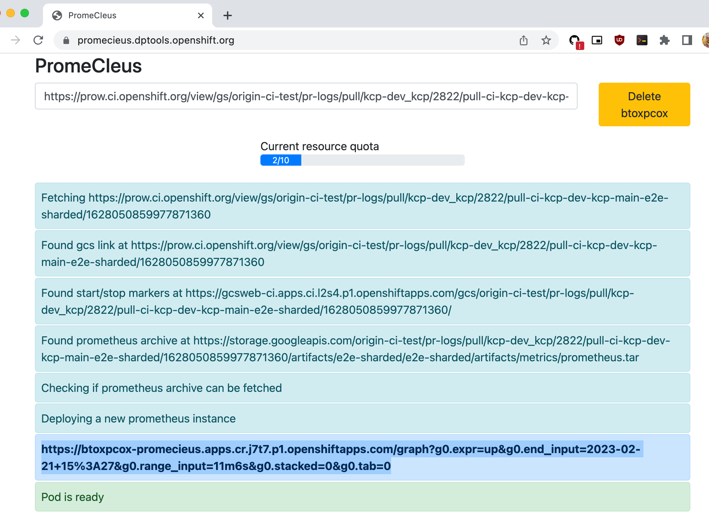

# Inspecting Prometheus metrics for e2e runs

## Metrics gathering during e2e runs

kcp internally exposes the same metrics as kube api-server.
These are being gathered during e2e runs if the `PROMETHEUS_URL` variable is set.
Here, any e2e spawned kcp server will publish a scraping configuration to prometheus
for the given Prometheus URL environment variable.

For e2e tests, the above environment variable is respected by the following test servers:

- when a shared kcp server is spawned using `SharedKcpServer` or `PrivateKcpServer` in the `kcp.test.e2e.framework` package.
- `cmd/sharded-test-server`
- `cmd/test-server/kcp`

## Inspecting metrics of e2e runs

### GitHub

To inspect metrics from GitHub e2e test runs, download the metrics from the GitHub summary page:


And execute Prometheus locally to inspect metrics:
```shell
$ mkdir -p metrics && unzip -p e2e-sharded-metrics.zip | tar xvzf - -C metrics
$ prometheus --storage.tsdb.path=metrics --config.file /dev/null
```

### Prow

To inspect e2e metrics from prow runs, just copy-paste the prow link from the pull request:


And paste it into [PromeCIeus](https://promecieus.dptools.openshift.org/):



Once the Prometheus pod is ready, the provisioned link can be called to inspect gathered metrics.
Alternatively, download the prometheus tarball from the gcsweb frontend locally
and start a Prometheus instance as described above.

## Collecting metrics locally

To collect metrics locally, a convenience script is available to download and execute a Prometheus instance.
Calling `... ./hack/run-in-prometheus make ...` will download, start, collect metrics, and stop Prometheus during the test run.

Example:
```shell
$ WHAT=./test/e2e/virtual/apiexport TEST_ARGS="-v -run TestAPIExportAuthorizers" ./hack/run-with-prometheus.sh make test-e2e
```
A local Prometheus can then be started to inspect gathered metrics:
```shell
$ ./hack/tools/prometheus --storage.tsdb.path=.prometheus_data --config.file /dev/null
```
