# Loadtest Report Apr 2026 - "Focus on Workspace Creation"

The following document is a summary of our first load-testing efforts. Its main scope is finding limits and factors which affect kcps workspace creation performance.

**The report splits into two main sections: Key "Takeaways for kcp operators" and "Insights and Actions for kcp maintainers"**

## General Information

Specifically we were looking at workspace creation performance in the following dimensions:

* Creation of 10000 workspaces at a uniform creation rate. Unless stated otherwise, rate was 8 workspaces per second
* Usage of 3 shards with embedded caching server (external cache to land in upcoming kcp release)
* Tests have been conducted using kcp 0.30.3
* Unless stated otherwise, the workspaces have been created in a symmetric tree structure of depth 5 and branching factor of 7

Disclaimer: As this is the first of our efforts, some minor parameters can slightly differ between runs.

## Takeaways for kcp Operators

### Prefer Workspace Trees Over Flat Hierarchies

In the following section, "flat hierarchy" refers to a workspace structure in which all 10000 workspaces have been placed directly in the root workspace. The term "symmetric tree" refers to a structure where all workspaces have been placed in a symmetric tree with a depth of 5 and a branching factor of 7.

Operators should prefer tree hierarchies over flat hierarchies. Placing all 10000 workspaces directly under the root can have massive negative performance implications, specifically introducing a cold-start phase. To put this into perspective: With a flat hierarchy, we were able to only achieve a stable workspace creation rate of 2 per second. Using a symmetric tree this value increased to 8 workspaces per second.

Example of a flat hierarchy suffering cold-start issues: Notice in the bottom right, how the `ready` and `req` lines diverge in the beginning (aka kcp creation can not keep up with requests). Later on requests are fulfilled successfully and we are even able to.

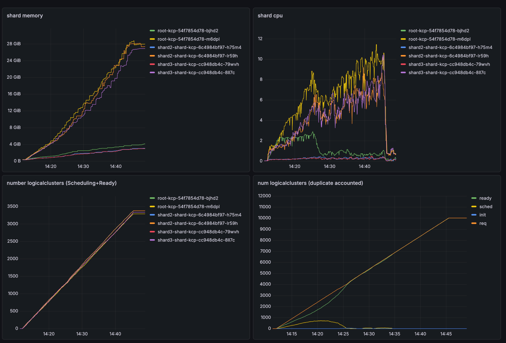

### Sizing Considerations

On highly active systems (workspace creation rates of more than 2 workspaces per second), we currently recommend to plan per empty workspace for 9.8 MiB of memory during high load and 7.4 MiB of memory after gc compaction. This recommendation is based on kcp v0.30.3 and we are actively looking into improving this in future releases.

Example for a multi-day observation with 10000 workspaces:

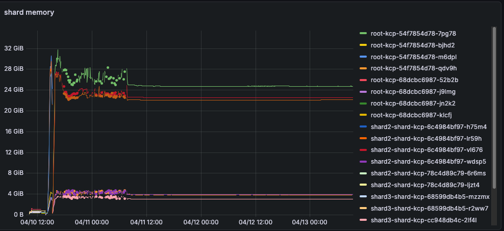

## Insights And Actions for kcp Maintainers

### Undesired Memory Retention

<https://github.com/kcp-dev/kcp/issues/4071>

After the deletion of logical clusters, memory is still being retained. This memory also is not fully re-used if clusters are scaled up again.

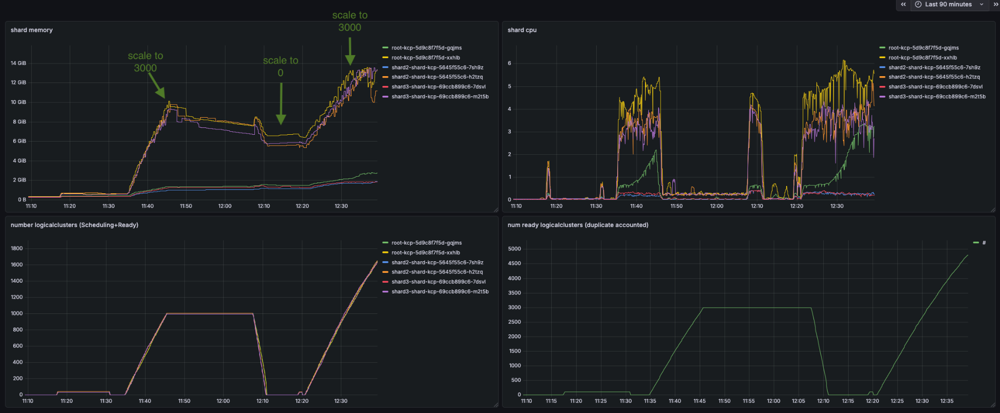

The effect can also be observed over multiple days where memory is still in use:

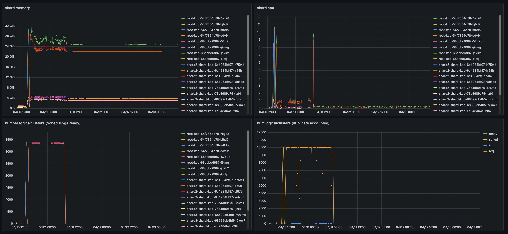

Deleting the pods frees up the memory again.

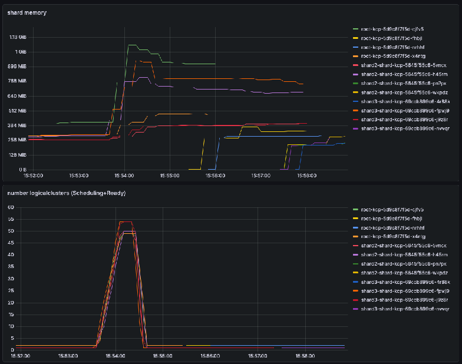

### Stalling Workspace Deletion

<https://github.com/kcp-dev/kcp/issues/4072>

If you have a symmetric tree of 10000 workspaces, it takes roughly 1 hour to delete all of them when using kubectl delete on the top-level workspace. Deletion does finish successfully, but stalls significantly after a couple of minutes.

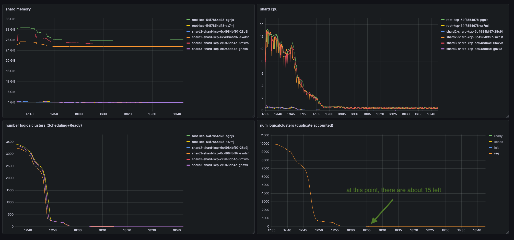

### High Metrics Cardinality

<https://github.com/kcp-dev/kcp/issues/4007>

The number of metrics produced by kcp increases steadily with the number of logical clusters. A kcp without any workspaces produces already ~25000 metrics, increasing the number to ~3000 workspaces, we produce over 160000 distinct metrics:

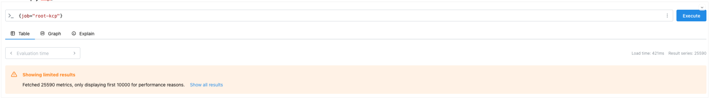

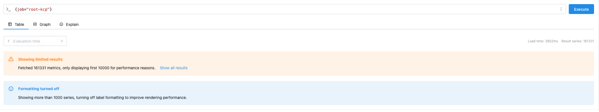

### Frontproxy Indexing Delay

<https://github.com/kcp-dev/kcp/issues/4073>

When deleting logical clusters, there is a multi-minute delay before it is picked up by front-proxy. This leads to kubectl get workspace requests to still display workspaces as ready, even though you cannot interact with them anymore. For example in the bottom right, you can see it takes ~9 minutes before indexing even triggers and afterwards it is lacking behind by minutes still.

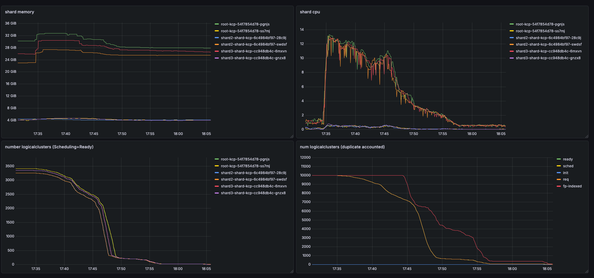

### Stale Metrics

<https://github.com/kcp-dev/kcp/issues/4072>

As previously mentioned the number of metrics increases with the number of logicalclusters in a kcp installation.
In addition, deleting logicalclusters does not reduce the number of metrics in an installation leaving behind stale entries.

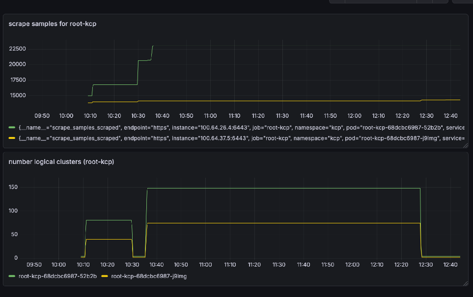

### Ghost LogicalCluster

<https://github.com/kcp-dev/kcp/issues/4010>

On a fresh kcp installation without any added workspaces/logicalclusters, metrics show logical clusters which are in a Scheduling state. These never become ready.

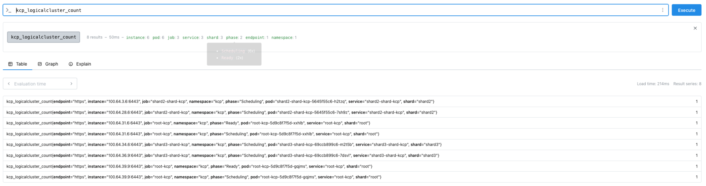
