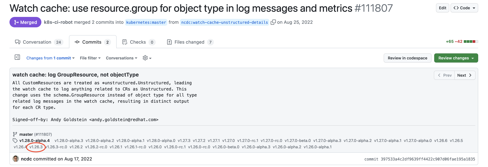

# Rebasing Kubernetes

This describes the process of rebasing kcp onto a new Kubernetes version. For the examples below, we'll be rebasing 
onto v1.26.3.

# 1. Update kcp-dev/apimachinery

1. Create a new branch for the update, such as `1.26-prep`.
2. Update go.mod:
   1. You may need to change the go version at the top of the file to match what's in go.mod in the root of the 
      Kubernetes repo. This is not required, but probably a good idea.
   2. Update the primary Kubernetes dependencies:
      ```
      go get -u k8s.io/api@v0.26.3 k8s.io/apimachinery@v0.26.3 k8s.io/client-go@v0.26.3
      ```
   3. Run `go mod tidy`.
3. Manually review the code that is upstream from `third_party` and make the same/similar edits to anything that 
   changed upstream. For example, we maintain a slightly modified copy of the
   [shared informer code](https://github.com/kubernetes/kubernetes/blob/v1.26.3/staging/src/k8s.io/client-go/tools/cache/shared_informer.go).
   In between 1.24 (the previous Kubernetes version upon which kcp was based) and 1.26, the `AddEventHandler`
   function was modified to return a `ResourceEventHandlerRegistration` and an `error`. To rebase
   kcp-dev/apimachinery onto Kubernetes v1.26.3, we had to make our copy do the same thing.
4. Run `make lint test`. Fix any issues you encounter.
5. Commit your changes.
6. Push to your fork.
7. Open a PR; get it reviewed and merged.

# 2. Update kcp-dev/code-generator

1. Create a new branch for the update, such as `1.26-prep`.
2. Update go.mod:
   1. You may need to change the go version at the top of the file to match what's in go.mod in the root of the
      Kubernetes repo. This is not required, but probably a good idea.
   2. Update the primary Kubernetes dependencies:
      ```
      go get -u k8s.io/apimachinery@v0.26.3 k8s.io/code-generator@v0.26.3
      ```
   3. Run `go mod tidy`.
3. Update Kubernetes tooling versions in the `Makefile`:
   1. `KUBE_CLIENT_GEN_VER := v0.26.3`
   2. `KUBE_LISTER_GEN_VER := v0.26.3`
   3. `KUBE_INFORMER_GEN_VER := v0.26.3`
   4. `KUBE_APPLYCONFIGURATION_GEN_VER := v0.26.3`
4. Update generators, if needed:
   1. Manually review upstream to check for any changes to these generators in the `kubernetes` repository:
      1. staging/src/k8s.io/code-generator/cmd/client-gen
      2. staging/src/k8s.io/code-generator/cmd/informer-gen
      3. staging/src/k8s.io/code-generator/cmd/lister-gen
   2. If there were any substantive changes, make the corresponding edits to our generators. For example, in between 
      1.24 and 1.26, upstream Kubernetes added shutdown support to shared informer factories. We had to add the same 
      thing to our generated shared informer factories.
   3. You'll probably want to commit your changes at this point.
5. Run `make codegen`. You'll probably want to commit these changes as a standalone commit.
6. Run `make lint test build` and fix any issues you encounter.
7. Commit any remaining changes.
8. Push to your fork.
9. Open a PR; get it reviewed and merged.

# 3. Update kcp-dev/client-go
1. Create a new branch for the update, such as `1.26-prep`.
2. Update go.mod:
   1. You may need to change the go version at the top of the file to match what's in go.mod in the root of the
      Kubernetes repo. This is not required, but probably a good idea.
   2. Update the `kcp-dev/apimachinery` dependency:
      ```
      go get -u github.com/kcp-dev/apimachinery@main
      ```
   3. That should have updated the primary Kubernetes dependencies, but in case it didn't, you can do so manually:
      ```
      go get -u k8s.io/api@v0.26.3 k8s.io/apimachinery@v0.26.3 k8s.io/client-go@v0.26.3
      ```
   4. Run `go mod tidy`.
   5. Update the kcp code-generator tooling version in the `Makefile`:
      1. Look up the latest commit from the main branch in https://github.com/kcp-dev/code-generator.
      2. Adjust `CODE_GENERATOR_VER` to match accordingly.
3. Manually review the code that is upstream from `third_party` and make the same/similar edits to anything that
   changed upstream.
4. Run `make codegen`. You'll probably want to commit these changes as a standalone commit.
5. Run `make lint` and fix any issues you encounter.
6. Commit any remaining changes.
7. Push to your fork.
8. Open a PR; get it reviewed and merged.

# 4. Update kcp-dev/kubernetes

## Terminology

Commits merged into `kcp-dev/kubernetes` follow this commit message format:

- `UPSTREAM: <UPSTREAM PR ID>`
  - The number identifies a PR in upstream kubernetes
    (i.e. `https://github.com/kubernetes/kubernetes/pull/<pr id>`)
  - A commit with this message should only be picked into the subsequent rebase branch
    if the commits of the referenced PR are not included in the upstream branch.
  - To check if a given commit is included in the upstream branch, open the referenced
    upstream PR and check any of its commits for the release tag (e.g. `v.1.26.3`)
    targeted by the new rebase branch. For example:
    
- `UPSTREAM: <carry>:`
  - A persistent carry that should probably be picked for the subsequent rebase branch.
  - In general, these commits are used to modify behavior for consistency or
    compatibility with kcp.
- `UPSTREAM: <drop>:`
  - A carry that should probably not be picked for the subsequent rebase branch.
  - In general, these commits are used to maintain the codebase in ways that are
    branch-specific, like the update of generated files or dependencies.

## Spreadsheet of carry commits from previous release

If the old branch (generally also the default branch) is `upstream/kcp-feature-logical-cluster-1.24-v3`
and the old version is `v1.24.3`, then a tsv file containing the set of carry commits that need to be
considered for cherry-picking later can be generated using:

```sh
# create column headers
echo 'Comment Sha\tSummary\tCommit link\tPR link\tAction' > ~/Documents/v1.24.3.tsv

# populate the sheet
git log $( git merge-base upstream/kcp-feature-logical-clusters-1.24-v3 v1.24.3 )..upstream/kcp-feature-logical-clusters-1.24-v3 --ancestry-path --reverse --no-merges --pretty='tformat:%h%x09%s%x09https://github.com/kcp-dev/kubernetes/commit/%h?w=1' | grep -E $'\t''UPSTREAM: .'$'\t' | sed -E 's~UPSTREAM: ([0-9]+)(:.)~UPSTREAM: \1\2\thttps://github.com/kubernetes/kubernetes/pull/\1~' >> ~/Documents/v1.24.3.tsv
```

The tsv file can be imported into a google sheets spreadsheet to track the progress of picking commits
to the new rebase branch. The spreadsheet can also be a way of communicating with rebase reviewers.
For an example, please see the [spreadsheet used for the v1.27.3 rebase](https://docs.google.com/spreadsheets/d/15k9sih-xBKICuLUHj4HMrqYf60mliaslImqqv6fGSJI/edit?usp=sharing).

## Rebase process

1. First and foremost, take notes of what worked/didn't work well. Update this guide based on your experiences!
2. Remember, if you mess up, `git rebase --abort` and `git reflog` are your very good friends!
3. Terminology:
   - "Old" version: the current version of Kubernetes that kcp is using
   - "New" version: the new Kubernetes version on top of which you are rebasing
4. The `upstream` in e.g. `upstream/kcp-feature-logical-cluster-1.24-v3` is the name of the git remote that points 
   to github.com/kcp-dev/kubernetes. Please adjust the commands below if your remote is named differently.
5. Prepare the old branch for rebasing:
   1. In this example, the old version is 1.24.3, and the new version is 1.26.3.
   2. Create a new temporary branch to clean up the accumulated commits on the old branch:
      ```
      git checkout -b kcp-1.24-clean upstream/kcp-feature-logical-cluster-1.24-v3
      ```
   3. Start by doing a soft git reset so your working directory contains all the changes from the branch in an
      uncommitted state:
      ```
      git reset v1.24.3 # this must be whatever upstream commit was the starting point for the old branch
      ```
   4. Revert the following types of changes:
      - go.mod/go.sum
      - Generated clients, listers, informers, applyconfigurations
      - vendor/*
      ```
      git checkout go.mod go.sum vendor

      # for any untracked files
      git clean -n -d vendor/* # to check what files would be removed
      git clean -f vendor/* # actually remove the new untracked files
      ```
   5. Create a single baseline commit:
      ```
      git add .
      git commit -m 'UPSTREAM: <carry>: baseline for kcp 1.24'
      ```
6. Create a baseline branch that starts from the new version. We'll use this to cherry-pick any commits from 
   upstream that we need to continue carrying (i.e., they have not yet merged into the new version).
   ```
   git checkout -b kcp-1.26-baseline v1.26.3
   ```
7. Review the list of carry commits in the spreadsheet generated above. Look
   for commit messages of the format 
   `UPSTREAM: 12345: ...`. The number indicates the upstream pull request. You'll need to inspect each pull request 
   to determine when it was merged. Anything that merged **before** the rebase version can be ignored and omitted 
   from the baseline branch. Anything that merged **after** the rebase version as well as anything not yet merged 
   must be cherry-picked to the baseline branch. For example, in 1.24, we have `UPSTREAM: 111898: Reflector: support 
   logging Unstructured type`. This was added in 1.27, and therefore needs to be cherry-picked to the
   `kcp-1.26-baseline` branch.
8. Create a branch where you'll attempt to do the rebase. This will start from the cleaned up old version branch:
   ```
   git checkout -b kcp-1.26-rebase kcp-1.24-clean
   ```
9. Rebase onto the baseline branch you created above:
   ```
   git rebase kcp-1.26-baseline
   ```
   
   You will likely encounter numerous conflicts. This is 100% normal! Go through each file and resolve them as best 
   as you can. Make notes of any particular changes you have questions about, so you don't forget them.
10. Update kcp dependencies, for all kcp repositories that changed. For example:
    ```
    hack/pin-dependency.sh github.com/kcp-dev/logicalcluster/v3 v3.0.4
    hack/pin-dependency.sh github.com/kcp-dev/apimachinery/v2 767ac05aebce82530dee46e9dab8c7bb47f1c823
    hack/pin-dependency.sh github.com/kcp-dev/client-go 654321d8cac56f9944e8cf801dc15e37b3a582f3
    ```
11. Review changes to the origins of pkg/genericcontrolplane to see if similar changes are needed in the new version:
   
   | Destination                                                      | Source(s)                                            |
   |------------------------------------------------------------------|------------------------------------------------------|
   | pkg/genericcontrolplane                                          | cmd/kube-apiserver/app, pkg/kubeapiserver/admission  |
   | pkg/genericcontrolplane/apis/apis.go                             | pkg/controlplane/instance.go                         |
   | pkg/genericcontrolplane/options.go                               | cmd/kube-apiserver/app/options/options.go            |
   | pkg/api/genericcontrolplane/scheme.go                            | pkg/api/legacyscheme/scheme.go                       |
   | pkg/apis/core/install/genericcontrolplane/install.go             | pkg/apis/core/install/install.go                     |
   | pkg/apis/core/register_generic_control_plane.go                  | pkg/apis/core/register.go                            |
   | pkg/apis/core/v1/register_generic_control_plane.go               | pkg/apis/core/v1/register.go                         |
   | staging/src/k8s.io/api/core/v1/register_generic_control_plane.go | staging/src/k8s.io/api/core/v1/register.go           |
   | pkg/registry/core/rest/genericcontrolplane/storage_core.go       | pkg/registry/core/rest/storage_core.go               |
   | pkg/kubeapiserver/legacy_storage_factory_builder.go              | pkg/kubeapiserver/default_storage_factory_builder.go |

12. Update generated clients, informers, listers, etc. because we generate logical cluster aware versions of these 
   for Kubernetes to use:
   ```
   hack/update-codegen.sh
   ```

13. Check if any new controllers were added to Kubernetes. If so, determine if they are relevant to the control 
    plane, or if they're specific to workloads (anything related to pods/nodes/etc.). If they're for the control 
    plane and you think they should be enabled in kcp, you have 1 of 2 choices:

    1. Modify the controller in Kubernetes to be logical cluster aware
    2. Add code to kcp to spawn a new controller instance scoped to a single logical cluster

    For option 1, follow what we did in pkg/controller/namespace/namespace_controller.go.

    For option 2, follow what we did in kcp in either the garbage collector or quota controllers.

14. Check if any new admission plugins were added to Kubernetes. Decide if we need them in kcp. If so, make a note 
    of them, and we'll add them to kcp below.

15. Push your commits to your fork of Kubernetes in GitHub.

16. Open a pull request for review **against the baseline branch, e.g. kcp-1.26-baseline**, but mark it `WIP` and maybe 
    even open it in draft mode - you don't want to merge anything just yet.

# 5. Update kcp-dev/kcp

1. At this point, you're ready to try to integrate the updates into kcp proper. There is still likely a good 
   amount of work to do, so don't get discouraged if you encounter dozens or hundreds of compilation issues at 
   this point. That's totally normal!
2. Update go.mod:
   1. You'll need to adjust the versions of kcp-dev/apimachinery, client-go, and logicalcluster to match any changes 
      you made in previous steps. Make sure the versions that are in the Kubernetes go.mod match the versions used here.
   2. If any new staging repositories were added in between the old and new Kubernetes versions, you'll need to add 
      those in the `replace` directive at the bottom of go.mod. For example, in the 1.26 rebase, we had to add 4:
      - k8s.io/dynamic-resource-allocation
      - k8s.io/kms
      - k8s.io/sample-cli-plugin
      - k8s.io/sample-controller
   3. Go ahead and make a commit here, as the next change we'll be making is to point kcp at your local checkout of 
      Kubernetes.
3. Point kcp at your local checkout of Kubernetes:
   ```
   # Change KUBE per your local setup
   KUBE=../../../go/src/k8s.io/kubernetes
   gsed -i "s,k8s.io/\(.*\) => .*/kubernetes/.*,k8s.io/\1 => $KUBE/vendor/k8s.io/\1,;s,k8s.io/kubernetes => .*,k8s.io/kubernetes => $KUBE," go.mod
   ```
   !!! warning
      Don't commit your changes to go.mod/go.sum. They point to your local file system.
4. Resolve any conflicts
5. Run `make modules`
6. Run `make codegen`
7. Keep iterating to get all the code to compile
8. Get the `lint` and `test` make targets to pass
9. Get the `e2e-*` make targets to pass.

# 6. Test CI

1. Undo your changes to go.mod and go.sum that point to your local checkout:
   ```
   git checkout -- go.mod go.sum
   ```
2. Update go.mod to point to your rebase branch in your Kubernetes fork:
   ```
   GITHUB_USER=<your username here> BRANCH=kcp-1.26-rebase hack/bump-k8s.sh
   ```
3. Commit this change with a message such as `UNDO: my Kubernetes`. We won't be using this commit when it's time to 
   merge, so we make it easy to find.
4. Open a pull request in kcp. Wait for CI results. The `deps` job will always fail at this point because it's 
   pointing to your fork of Kubernetes. This is expected, so don't worry. Your job at this point is to get all the 
   other CI jobs to pass.

# 7. Get it merged!

1. Once CI is passing (except for the `deps` job, as expected), we're ready to merge!
2. Coordinate with another project member - show them the test results, then get them to approve your rebase PR in 
   kcp-dev/kubernetes. Get the PR merged (this is something that currently must be done manually - ask someone with 
   merge rights to do it for you if you need help).
3. Rename/create a new branch in kcp-dev/kubernetes based off what you just merged into kcp-1.26-baseline - this is 
   the actual rebase! The new branch could be named something like `kcp-1.26`.
4. Back in your local checkout of kcp, update to the kcp-dev/kubernetes rebase branch:
   ```
   BRANCH=kcp-1.26 hack/bump-k8s.sh
   ```
5. Commit this change. You can either squash this with your previous `UNDO` commit (reword it so it's not an `UNDO` 
   any more), or drop the `UNDO` commit and replace it with this one.
6. Check on CI. Hopefully everything is green. If not, keep iterating on it.

# 7. Update the default branch in kcp-dev/kubernetes

1. Change it to your new rebase branch, e.g. `kcp-1.26`
